# SpringBoot

1. SpringBott可以轻松创建独立的、生产级的基于Spring的应用程序
2. SoringBoot直接嵌入Tomcat、Jetty或Undertow，可以**直接运行**Spring

## 快速入门

- 构建一个SpringBoot项目，浏览器发送/hello请求(http://localhost:8080/hello)，响应`Hello, SpringBoot`

1. 在 `pom.xml` 文件中引入SpringBoot父工程和web项目场景启动器
   - 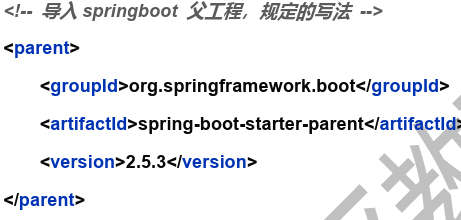
   - 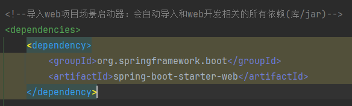
2. 创建SpringBoot应用主程序 `MainApp.java`
3. 创建控制器 `HelloController.java`

```java
package com.charlie.springboot;

import org.springframework.boot.SpringApplication;
import org.springframework.boot.autoconfigure.SpringBootApplication;

/**
 * @SpringBootApplication：标识这是一个SpringBoot应用
 */
@SpringBootApplication
public class MainApp {
    public static void main(String[] args) {
        // 启动SpringBoot应用程序/项目
        SpringApplication.run(MainApp.class, args);
    }
}
```

```java
package com.charlie.springboot.controller;

import org.springframework.stereotype.Controller;
import org.springframework.web.bind.annotation.RequestMapping;
import org.springframework.web.bind.annotation.ResponseBody;

@Controller
public class HelloController {

    @RequestMapping("/hello")
    @ResponseBody
    public String hello() {
        return "Hello, SpringBoot!";
    }
}
```

### 小结

1. SpringBoot比较传统的SSM开发，简化整合步骤，提高开发效率
2. 简化了Maven项目的`pom.xml`依赖导入, 可以说是一键导入
   - 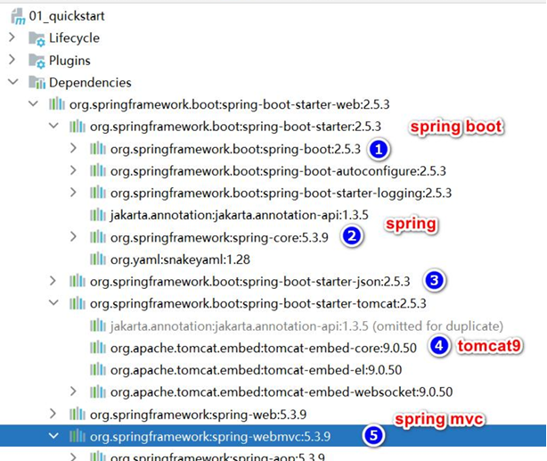
3. 引入一个 spring-boot-starter-web, 到底发生了什么?
   - 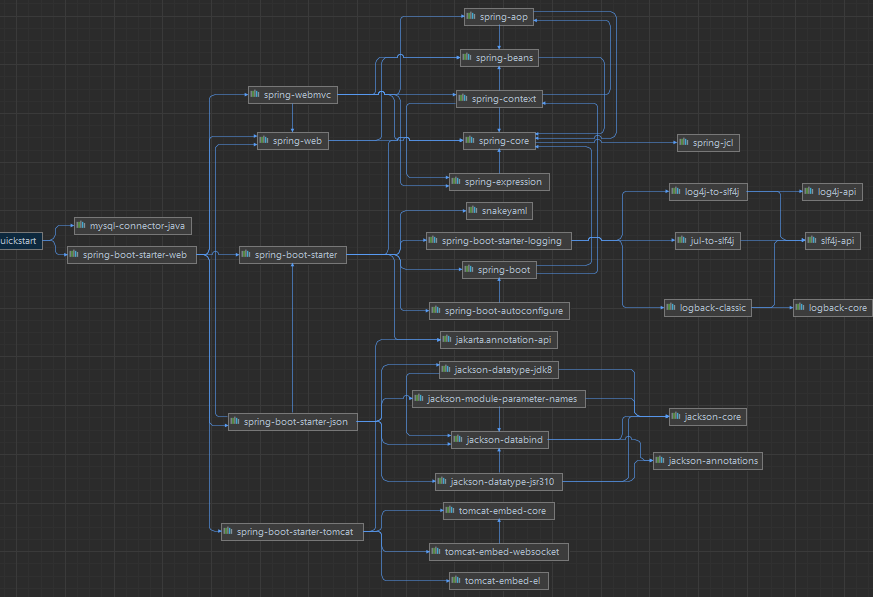
4. 内置Tomcat, 简化服务器的配置

### Spring和SpringMVC和SpringBoot关系

1. SpringBoot>Spring>SpringMVC
2. SpringMVC只是Spring处理WEB层请求的一个模块/组件,SpringMVC的基石是`Servlet`
3. Spring的核心是IOC和AOP,**IOC提供了依赖注入的容器**，**AOP解决了面向切面编程**
4. SpringBoot是为了简化开发，推出的封神框架(**约定优于配置[COC]**，简化了Spring项目 的配置流程),SpringBoot包含很多组件/框架，
   Spring就是最核心的内容之一，也包含 SpringMVC
5. Spring家族，有众多衍生框架和组件例如boot、security、jpa等，他们的基础都是Spring

### 约定优于配置

1. 约定优于配置(Convention over Configuration/COC)，又称按约定编程，是一种软件设计规范，本质上是对系统、类库或框架中一些东西假定一个大众化合理的默认值(缺省值)
2. **期待的配置与约定的配置一致，那么就可以不做任何配置**，约定不符合期待时, 才需要对约定进行替换配置
3. 约定其实就是一种规范，遵循了规范，那么就存在通用性，存在通用性，那么事情就会变得相对简单，程序员之间的沟通成本会降低，工作效率会提升，合作也会变得更加简单
4. 例如在模型中存在一个名为User的类，那么对应到数据库会存在一个名为user的表，只有在偏离这个约定时才需要做相关的配置 (例如你想将表名命名为t_user等非user时才
   需要写关于这个名字的配置)

## 依赖管理和自动配置

### 依赖管理

1. spring-boot-starter-parent 还有父项目, 声明了开发中常用的依赖的版本号
2. 并且进行**自动版本仲裁**，即如果程序员没有指定某个依赖jar的版本，则以父项目指定的版本为准
   - 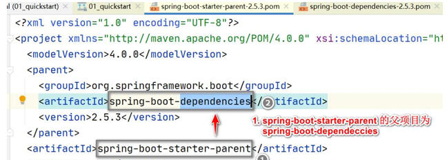
   - 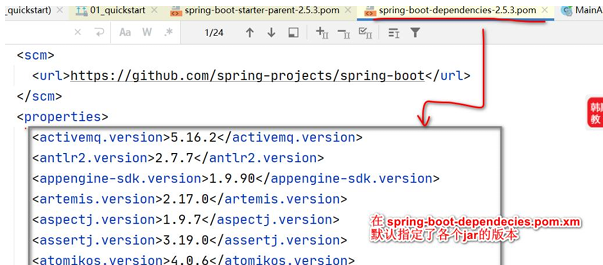
3. 修改自动仲裁/默认版本号
   1) 查看spring-boot-dependencies.pom里面规定当前依赖的版本对应的key, 如mysql.version
      - 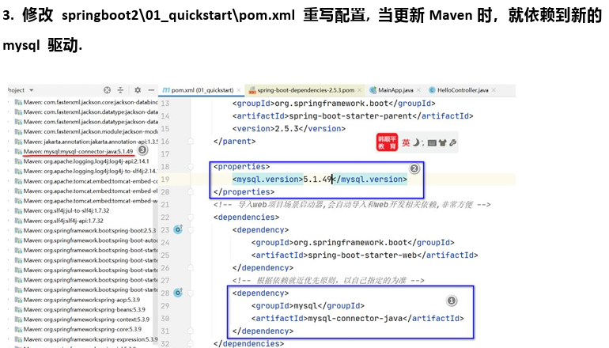
   2) 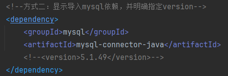

### starter场景启动器

- 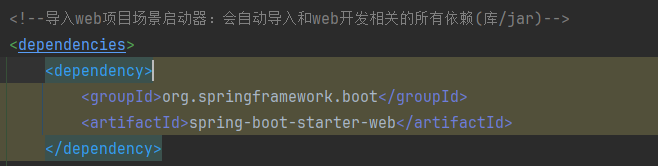
- 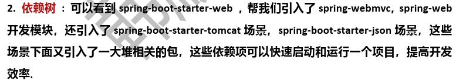
- 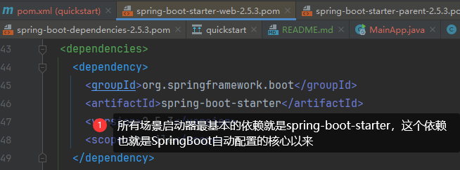
- 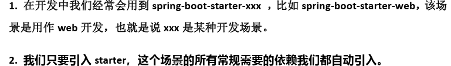
- 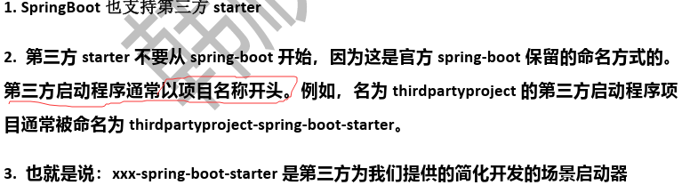

### 自动配置

- SpringBoot自动配置了Tomcat，SpringMVC等
  - 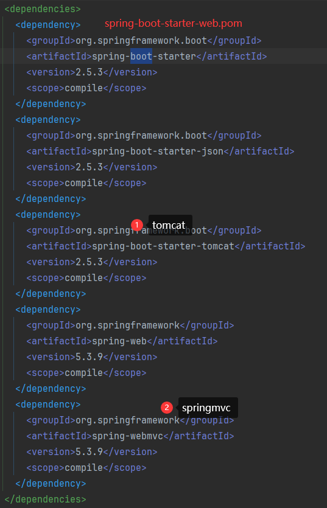
- **自动配置遵循按需加载原则**，即引入了哪些场景starter就会加载该场景关联的jar包，没有引入的starter，则不会加载器关联的jar
  - 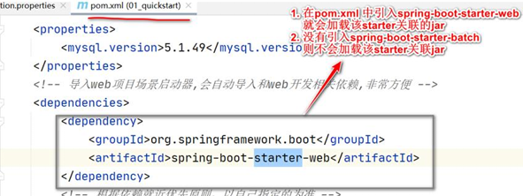

```java
/**
 * @SpringBootApplication：标识这是一个SpringBoot应用
 *      - String[] scanBasePackages() default {};
 *      - scanBasePackages = {"com.charlie"} 指定SpringBoot要扫描的包及其子包，可以指定多个包
 */
@SpringBootApplication(scanBasePackages = {"com.charlie"})
public class MainApp {
    public static void main(String[] args) {
        // 启动SpringBoot应用程序/项目
        ConfigurableApplicationContext ioc = SpringApplication.run(MainApp.class, args);
        // 如何查看容器中注入的组件
        String[] beanDefinitionNames = ioc.getBeanDefinitionNames();
        for (String beanDefinitionName : beanDefinitionNames) {
            System.out.println("beanDefinitionName=" + beanDefinitionName);
        }
    }
}
```

- 自动配置：默认扫描包结构。默认扫描主程序 `MainApp.java` 所在包及其子包
  - 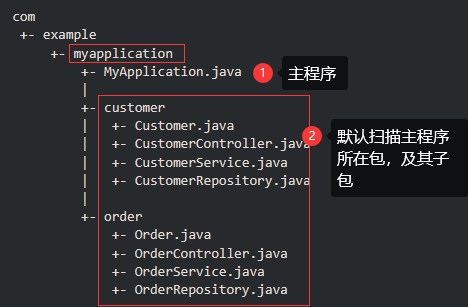
- 修改默认配置：通过注解 `@SpringBootApplication(scanBasePackages = {"com.charlie"})`
  - 指定springboot扫描的包(同时会扫描其子包)，多条路径的话用逗号分隔即可

### resources\application.properties配置

- SpringBoot项目最重要也是最核心的配置文件就是 `application.properties`，所有框架配置都可以在该文件中说明
- [application.properties配置大全](https://blog.csdn.net/pbrlovejava/article/details/82659702)
- 各种配置都有默认配置(约定)，可以在 `resources\application.properties`中修改

```properties
# 修改server的监听窗口(端口号)
server.port=10001
# 应用的上下文路径(项目路径application_context)
server.servlet.context-path=/sb

# multipart 修改文件上传的大小
# multipart.max-file-size属性可以指定SpringBoot上传文件的大小限制
# 默认配置最终都是映射到某个类，比如multipart.max-file-size会映射/关联到MultipartProperties上，把光标定位在属性上
# 按 ctrl+b 就会定位到这个属性关联到的类(字段)
spring.servlet.multipart.max-file-size=5MB

# 自定义配置属性
my.website=http://www.baidu.com
```

- 对于properties文件中的自定义配置，可以通过 `@Value("${}")` 获取对应属性值
- 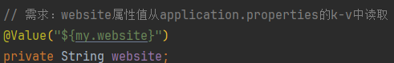

### SpringBoot在哪配置读取application.properties

- 读取配置文件在 `ConfigFileApplicationListener.java`中
  - 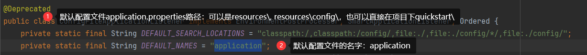
- SpringBoot所有的自动配置功能都在 `spring-boot-autoconfigure` 包里面
  - 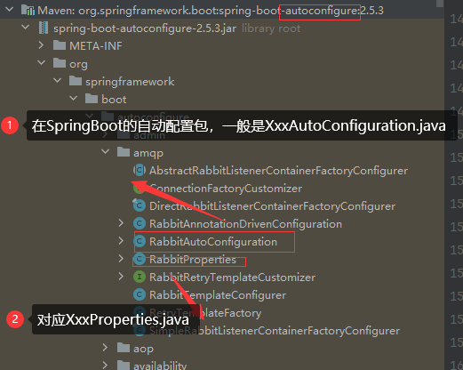
- `XxxProperties.java`和`XxxAutoConfiguration.java`都会加载到IOC容器中。
  - `XxxProperties.java`包含`Xxx`字段的默认值，通过 `application.properties` 可以进行自定义修改
  - `XxxAutoCOnfiguration.java`中定义了 `XxxProperties.java` 属性，读取了其中的配置
  - 执行流程：当在 `application.properties` 中修改了Xxx属性默认值，则先会在 `XxxProperties.java` 中setXxx该值，
    然后，会到 `XxxAutoConfiguration.java` 中将xxxProperties属性赋值给对应字段。最后该两个Bean都会注入到Ioc容器中

## 容器功能

### Spring注入组件的注解

- 
- 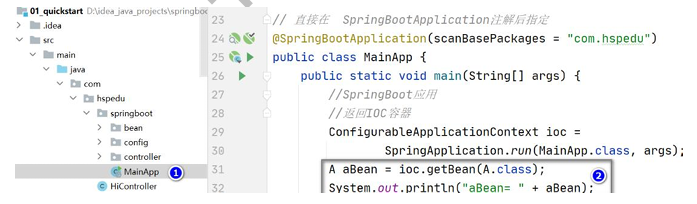

### @Configuration

> 在SpringBoot中通过 `@Configuration` 创建配置类来注入组件

传统方式通过**配置文件**注入组件
- 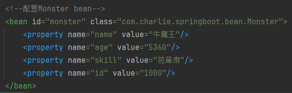

```java
package com.charlie.springboot.config;

import com.charlie.springboot.bean.Monster;
import org.springframework.context.annotation.Bean;
import org.springframework.context.annotation.Configuration;
import org.springframework.context.annotation.Scope;

/**
 * 1. @Configuration：表示/标识这是一个配置类，等价于之前的beans.xml配置文件
 * 2. 这时就可以通过 @Bean 注解，注入bean对象到容器
 * 3. 当一个类被 @Configuration 修饰时，该类/Bean也会被注入到容器
 */
@Configuration(proxyBeanMethods = false)
public class BeanConfig {

    /**
     * 1. @Bean：给容器添加组件，就是 Monster bean
     * 2. monster01()：默认方法名 monster01 作为Bean的名字/id
     * 3. Monster：注入类型，方法的返回类型作为注入Bean的类型
     * 4. new Monster(200, "牛魔王", 500, "牛气冲天")：注入到容器中具体的Bean信息，类似文件配置中的属性值
     * 5. @Bean(name = "monster_nmw")：在配置/注入Bean时指定名字/id为 monster_nmw
     * 6. 默认是单例注入
     * 7. @Scope("prototype")：多例，每获取一次创建一个新的对象
     */
    //@Bean(name = "monster_nmw")
    @Bean
    //@Scope("prototype")
    public Monster monster01() {
        return new Monster(200, "牛魔王", 500, "牛气冲天");
    }
}
```

```
/** 演示 @Configuration 注解 **/
// 从BeanConfig配置类/容器获取bean实例
Monster monster01 = ioc.getBean("monster01", Monster.class);
Monster monster02 = ioc.getBean("monster01", Monster.class);
// monster01: Monster{id=200, name='牛魔王', age=500, skill='牛气冲天'} 838800272
System.out.println("monster01: " + monster01 + " " + monster01.hashCode());
// monster02: Monster{id=200, name='牛魔王', age=500, skill='牛气冲天'} 838800272
System.out.println("monster02: " + monster02 + " " + monster02.hashCode());
```

#### @Configuration注意事项和细节

1. 配置类本身也是组件，因此也可以获取
   - 
2. SpringBoot2新增特性：proxyBeanMethods指定`Full`模式和`Lite`模式
3. 配置类可以有多个，就和Spring中可以有多个ioc配置文件一样。如果配置类中的Bean名称重复会报错，因为是在同一个ioc容器中
4. 注意：配置类(BeanConfig)类似于之前的配置文件(beans.xml)，其中@Bean注解的方法(monster01()等)类似于文件中的配置。
   - 记得在方法上加上@Bean注解，才会将组件注入到容器中！

```java
package com.charlie.springboot.config;

import com.charlie.springboot.bean.Monster;
import org.springframework.context.annotation.Bean;
import org.springframework.context.annotation.Configuration;
import org.springframework.context.annotation.Scope;

/**
 * 1. @Configuration：表示/标识这是一个配置类，等价于之前的beans.xml配置文件
 * 2. 这时就可以通过 @Bean 注解，注入bean对象到容器
 * 3. 当一个类被 @Configuration 修饰时，该类/Bean也会被注入到容器
 */

/** 注意事项和使用细节
 * 1. proxyBeanMethods：代理bean的方法
 * 2. Full(proxyBeanMethods=true)：保证每个@Bean注解的方法调用多次返回的组件都是单例的，即代理方式
 * 3. List(proxyBeanMethods=false)：每个@Bean方法被调用多少次返回的组件都是新创建的，即非代理方式
 * 4. 注意：proxyBeanMethods是在调用 @Bean 方法(如monster01()等)时才生效，因此需要先获取BeanConfig组件，再调用方法
 * 5. 直接通过SpringBoot主程序得到的容器来获取Bean(ioc.getBean("monster01", Monster.class))获取时，该proxyBeanMethods并没有生效
 * 6. 如何选择： 组件依赖必须使用 Full 模式默认。如果不需要组件依赖使用 Lite 模式
 * 7. Lite模式也称为轻量级模式，因为不检测依赖关系，运行速度快
 */
@Configuration(proxyBeanMethods = false)
public class BeanConfig {

    /**
     * 1. @Bean：给容器添加组件，就是 Monster bean
     * 2. monster01()：默认方法名 monster01 作为Bean的名字/id
     * 3. Monster：注入类型，方法的返回类型作为注入Bean的类型
     * 4. new Monster(200, "牛魔王", 500, "牛气冲天")：注入到容器中具体的Bean信息，类似文件配置中的属性值
     * 5. @Bean(name = "monster_nmw")：在配置/注入Bean时指定名字/id为 monster_nmw
     * 6. 默认是单例注入
     * 7. @Scope("prototype")：多例，每获取一次创建一个新的对象
     */
    //@Bean(name = "monster_nmw")
    @Bean
    //@Scope("prototype") 这里的注解，只对直接使用容器获取Bean时生效，即 ioc.getBean("monster01", Monster.class);
    public Monster monster01() {
        return new Monster(200, "牛魔王", 500, "牛气冲天");
    }
}
```

```
/** 演示 @Configuration(proxyBeanMethods = false) **/
// 1. 先得到BeanConfig组件
BeanConfig beanConfig = ioc.getBean(BeanConfig.class);
Monster monster_01 = beanConfig.monster01();
Monster monster_02 = beanConfig.monster01();
// 当 @Configuration(proxyBeanMethods = true)：单例，返回对象hashCode相同
// 当 @Configuration(proxyBeanMethods = false)：每次返回的是一个新的对象，非代理方式
System.out.println("monster_01=" + monster_01 + " " + monster_01.hashCode());
System.out.println("monster_02=" + monster_02 + " " + monster_02.hashCode());

/** 直接通过ioc.getBean获取时，proxyBeanMethods 不生效 **/
// monster01和monster02是同一个对象
// 对于@Bean直接注入到容器的bean对象，其是否是单例由方法上的注解@Scope决定
Monster monster01 = ioc.getBean("monster01", Monster.class);
Monster monster02 = ioc.getBean("monster01", Monster.class);
System.out.println("monster01=" + monster01 + " " + monster01.hashCode());
System.out.println("monster02=" + monster02 + " " + monster02.hashCode());
```

### @Import

- 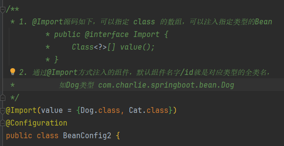

### @Conditional

1. 条件装配：满足 `Conditional` 指定的条件，则进行组件注入
2. `@Conditional`是一个跟注解，下面有很多扩展注解
   - 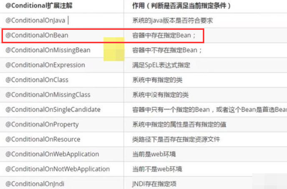

```java
package com.charlie.springboot.config;

/**
 * 1. @Import源码如下，可以指定 class 的数组，可以注入指定类型的Bean
         * public @interface Import {
         *     Class<?>[] value();
         * }
 * 2. 通过@Import方式注入的组件，默认组件名字/id就是对应类型的全类名，
 *          如Dog类型 com.charlie.springboot.bean.Dog
 */
@Import(value = {Dog.class, Cat.class})
@Configuration
public class BeanConfig2 {

    @Bean
    public Monster monster02() {
        return new Monster(800, "蜘蛛精", 80, "盘丝洞");
    }

    @Bean
    /**
     * 1. @ConditionalOnBean(name = "monster_nmw") 表示
     * 2. 当容器中有一个Bean，名字是monster_nmw时，就注入dog01这个Dog的bean
     * 3. 如果没有，就不进行注入
     * 4. 该注解只对Bean的名字进行约束，并不检测其类型，即只要有名为monster_nmw的bean就可以
     * 5. 还有很多其它的条件约束注解，如 @ConditionalOnMissingBean(name="monster_nmw")表示在容器中没有名字/id为的monster_nmw，才进行注入
     * 6. @ConditionalOnBean 注解可以加载BeanConfig配置类上，表示该类下所有要注入的组件都需要满足约束条件才进行注入
     */
    @ConditionalOnBean(name = "monster_nmw")
    public Dog dog01() {
        return new Dog();
    }
}
```

### @ImportResource

1. 作用：原生配置文件引入，即可以导入Spring传统的`beans.xml`，可以认为是SpringBoot对Spring容器文件的兼容
2. 如下将beans.xml文件导入BeanConfig.java配置类，可以获得beans.xml注入/配置的组件

```java
package com.charlie.springboot.config;

@Configuration
// 导入beans.xml，就可以获取到beans.xml中配置的bean
@ImportResource(locations = "classpath:beans.xml")
// 启动对特定类的配置属性支持，加上该注解后，不需要在原Bean上再加@Component注解
//@EnableConfigurationProperties({Furn.class})
public class BeanConfig03 {

}
```

### 配置绑定

1. 使Java读取到SpringBoot核心配置文件`application.properties`的内容，并且把它封装到JavaBean中
2. 需求：将application.properties指定的k-v和JavaBean绑定
3. 通过注解 `@ConfigurationProerties` 在JavaBean中指定其属性来源`prefix="furn01"`，即在配置文件中的前缀

```properties
# 设置Furn的属性k-v
# 前面的furn01是用于指定/区别不同的绑定对象，这样可以再绑定Furn bean的属性时，通过furn01前缀进行区分
# furn01.id 中的id就是要绑定的Furn bean的属性名
furn01.id=100
furn01.name=电视机
furn01.price=1688
```

```java
package com.charlie.springboot.bean;

import org.springframework.boot.context.properties.ConfigurationProperties;
import org.springframework.stereotype.Component;

@Component
@ConfigurationProperties(prefix = "furn01")
public class Furn {
    private Integer id;
    private String name;
    private Double price;

    // 这里省略了setter和getter方法，实际是需要的
}
```

```java
package com.charlie;

@Controller
public class HiController {

    // 装配到HiController
    @Resource
    private Furn furn;

    @RequestMapping("/furn")
    @ResponseBody
    public Furn getFurn() {
        return furn;
    }
}
```

> 知识回顾——自动装配
> - `@Autowire`
>   1. 在IOC容器中查找待装配的组件的类型，如果有唯一的bean匹配(按类型来)，则使用该bean装配
>   2. 如待装配的类型对应的bean在IOC容器中有多个，则使用待装配的属性的名字(userService)作为id再进行查找，找到就装配，找不到就抛出异常
> - `@Resource`
>   1. @Resource 有两个属性是比较重要的，分别是name和type，Spring将@Resource注解的name属性解析为bean的名字 而type属性则解析为bean的类型，
>      如果使用name属性，则使用byName的自动注入策略，而使用type属性时则使用byType自动注入策略，这时要求只能有一个该类型的
>   2. 如果@Resource没有指定name和type，则先使用byName注入策略，如果匹配不到，再使用byType策略，如果都不成功，就会报错

- 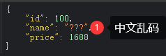
- 如果 `application.properties`中有中文，需要**转成unicode编码**写入，否则会出现乱码

## SpringBoot底层机制

[SpringBoot底层机制](my_springboot/README.md)

## lombok

1. lombok简化javabean的开发，可以使用lombok注解使代码更加简洁
2. Java项目中，**很多没有技术含量但又必须存在的代码**：POJO的getter/setter/toString；异常处理；IO流的关闭操作等等

| lombok常用注解            | 功能                                                              |
|-----------------------|-----------------------------------------------------------------|
| `@Data`               | 提供类所有属性的getter和setter方法，以及equals、canEquals、hashCode、toString等方法 |
| `@Setter`             | 同`@Getter`，为属性提供setter或getter方法                                 |
| `@Log4j`              | 为类提供一个属性名为log的log4j值日对象                                         |
| `@NoArgsConstructor`  | 为类提供一个无参的构造方法                                                   |
| `@AllArgsConstructor` | 为类提供一个全参的构造方法                                                   |
| `@Clearup`            | 可以关闭流                                                           |
| `@Builder`            | 被注解的类加个构造者模式                                                    |

```xml
<!--引入lombok，使用版本仲裁-->
<dependency>
    <groupId>org.projectlombok</groupId>
    <artifactId>lombok</artifactId>
</dependency>
```

- 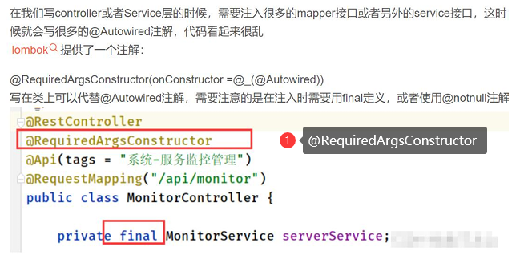

```java
package com.charlie.springboot.bean;

import lombok.*;
import org.springframework.boot.context.properties.ConfigurationProperties;
import org.springframework.stereotype.Component;

@Component
@ConfigurationProperties(prefix = "furn01")     // 配置属性是通过setter方法设置的，因此需要这些方法
@ToString   // 在编译时，生成toString方法
/**
 * 1. Equivalent to {@code @Getter @Setter @RequiredArgsConstructor @ToString @EqualsAndHashCode}.
 * 2. @Data 注解等价于使用了如下注解 @Getter @Setter @RequiredArgsConstructor @ToString @EqualsAndHashCode
 * 3. @RequiredArgsConstructor
 */
//@Data
/**
 * 1. 在编译时，会生成无参构造器
 * 2. 当有其它构造器生成时，默认生成的无参构造器会被覆盖掉。如果仍希望有无参构造器，就需要使用 @NoArgsConstructor
 */
@NoArgsConstructor
@AllArgsConstructor     // 在编译时，会生成全参构造器
@Getter         // 前端返回json数据是通过getter获取的属性，如果没有的话，前端拿不到数据。xx.id底层是xx.getId()
@Setter         // 配置属性需要，如果没有的话，所有字段都为null
public class Furn {
    private Integer id;
    private String name;
    private Double price;
}
```

- IDEA安装lombok插件，可以使用拓展功能如日志输出

```java
package com.charlie;

import lombok.extern.slf4j.Slf4j;

import javax.annotation.Resource;

@Slf4j
@Controller
public class HiController {
    @Resource
    private Furn furn;
    
    @RequestMapping("/furn")
    @ResponseBody
    public Furn getFurn() {
        // 使用Slf4j日志输出
        log.info("furn: " + furn);  // 普通输出
        log.info("furn={}", furn);  // 占位符输出
        return furn;
    }
}
```

## Spring Initializr

1. 程序员通过`MavenArchetype`来生成Maven项目，项目原型相对简陋，需要手动配置，比较灵活
2. 通过Spring官方提供的`SpringInitializr`来构建Maven项目，能完美支持IDEA和Eclipse。可以选择需要的开发场景(starter)，
   还能自动生成启动类和单元测试代码
3. 方式1：IDEA创建
   - 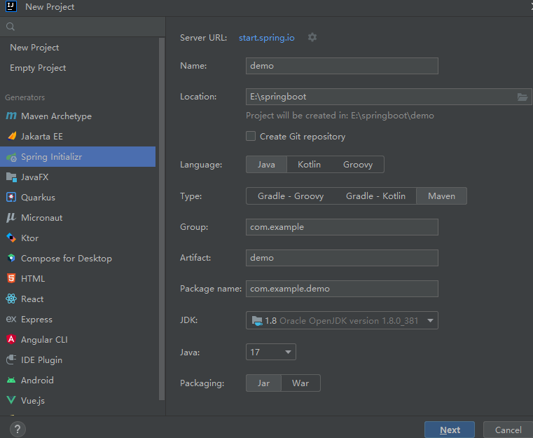
4. 方式2：[start.spring.io创建](https://start.spring.io/)
   - 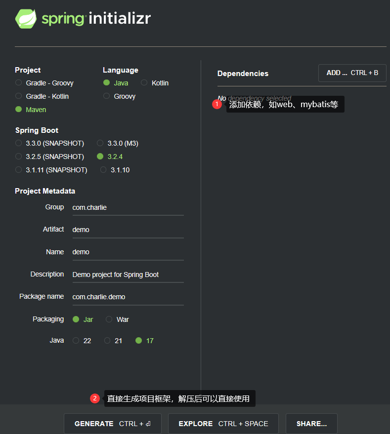
   - 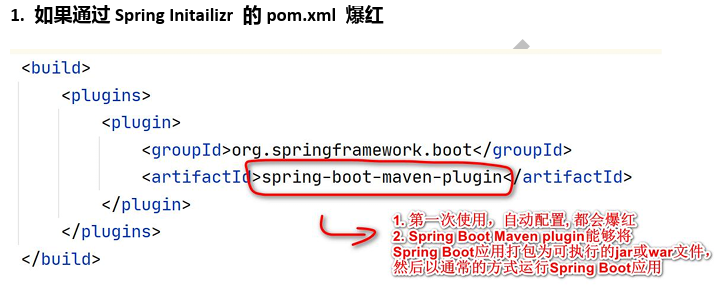
   - 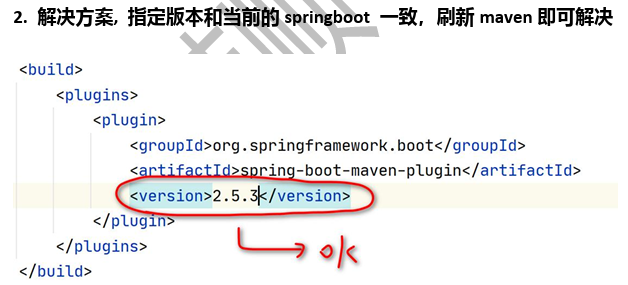

## yaml

[application.yml](configuration/src/main/resources/application.yml)

1. `YAML`是"YAML Ain't Markup Language(YAML不是标记语言)"的递归缩写。在开发的这种语言时，YAML 的意思其实是：
    "Yet Another Markup Language"(仍是一种标记语言)，是为了强调这种语言**以数据做为中心**，而不是以标记语言为重点，而用反向缩略语重命名
2. `YAML`以数据做为中心，而不是以标记语言为重点
3. `YAML`非常适合用来做以数据为中心的配置文件
4. [yaml for java](https://www.cnblogs.com/strongmore/p/14219180.html)
5. yaml基本语法
   1) 形式为`key: value`；注意`:后面有空格`
   2) **区分大小写**
   3) 使用**缩进**表示层级关系
   4) 缩进不允许使用tab，只允许**空格** [有些地方也识别tab, 推荐使用空格]
   5) 缩进的空格数不重要，只要**相同层级的元素左对齐**即可
   6) 字符串无需加引号
   7) yaml中，注释使用`#`

### 数据类型

1. 字面量：单个的、不可再分的值。date、boolean、string、number、null
   - 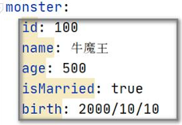
2. 对象：键值对的集合, 比如 map、hash、set、object
   - 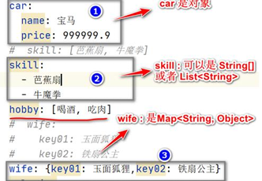
3. 数组：一组按次序排列的值,比如array、list、queue
   - 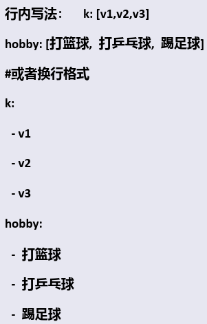

### yaml应用实例

- 需求：使用yaml配置文件和JavaBean进行数据绑定，体会yaml使用方式

```java
package com.charlie.springboot.bean;

@Data
public class Car {
    private String name;
    private Double price;
}
```

```java
package com.charlie.springboot.bean;

@Component
@ConfigurationProperties(prefix = "monster")    // 该前缀名就是yml文件中对象名
@Data
public class Monster {
    private Integer id;
    private String name;
    private Integer age;
    private Boolean isMarried;
    private Date birth;
    private Car car;
    private String[] skill;
    private List<String> hobby;
    private Map<String, Object> wife;
    private Set<Double> salaries;
    private Map<String, List<Car>> cars;
}
```

```yaml
monster:
  id: 100
  name: 牛魔王
  age: 500
  isMarried: true
  birth: 2000/11/22
  car:  # 换行格式
    name: 五菱宏光
    price: 75000
#  car: {name: 五菱神光, price: 60000} # 行内

  # 数组
  skill:
    - 牛牛冲击
    - 法天相地
#  skill: [芭蕉扇, 牛魔长拳]  # 行内

  # List<String>
#  hobby: [喝酒, 吃肉]
  hobby:
    - 晒太阳
    - 泥潭打滚

  # Map<String, Object>
#  wife: {no1: 玉面兔, no2: 铁扇公主}  # 行内
  wife:
    no1: 玉面兔子
    no2: 铁山公主

  # Set<Double>
#  salaries: [1000, 2000]
  salaries:
    - 11111
    - 2222

  # Map<String, List<Car>>
  cars:   # 因为cars k-v v是List<Car> 所以使用换行风格
    group1:
      - {name: 迈巴赫, price: 1600}
      - name: 普尔曼
        price: 2800
    group2:
      - {name: 宾利, price: 3000}
      - name: 劳斯莱斯
        price: 1800
```

### yaml使用细节

1. 如果 `application.properties` 和 `application.yaml` 有相同的前缀值绑定，则 `application.properties` 优先级更高。
   - 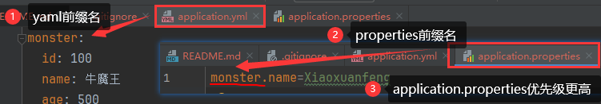
2. 字符串无需加引号，如果用`""`或`''`包起来也可以
3. 在`pom.xml`加入`spring-boot-configuration-processor`依赖，可以提示配置对象(如Monster)的属性
