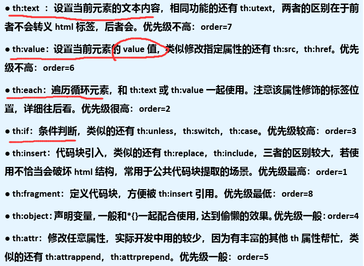

# SpringBoot

1. SpringBott可以轻松创建独立的、生产级的基于Spring的应用程序
2. SoringBoot直接嵌入Tomcat、Jetty或Undertow，可以**直接运行**Spring

## 快速入门

- 构建一个SpringBoot项目，浏览器发送/hello请求(http://localhost:8080/hello)，响应`Hello, SpringBoot`

1. 在 `pom.xml` 文件中引入SpringBoot父工程和web项目场景启动器
   - 
   - 
2. 创建SpringBoot应用主程序 `MainApp.java`
3. 创建控制器 `HelloController.java`

```java
package com.charlie.springboot;

import org.springframework.boot.SpringApplication;
import org.springframework.boot.autoconfigure.SpringBootApplication;

/**
 * @SpringBootApplication：标识这是一个SpringBoot应用
 */
@SpringBootApplication
public class MainApp {
    public static void main(String[] args) {
        // 启动SpringBoot应用程序/项目
        SpringApplication.run(MainApp.class, args);
    }
}
```

```java
package com.charlie.springboot.controller;

import org.springframework.stereotype.Controller;
import org.springframework.web.bind.annotation.RequestMapping;
import org.springframework.web.bind.annotation.ResponseBody;

@Controller
public class HelloController {

    @RequestMapping("/hello")
    @ResponseBody
    public String hello() {
        return "Hello, SpringBoot!";
    }
}
```

### 小结

1. SpringBoot比较传统的SSM开发，简化整合步骤，提高开发效率
2. 简化了Maven项目的`pom.xml`依赖导入, 可以说是一键导入
   - 
3. 引入一个 spring-boot-starter-web, 到底发生了什么?
   - 
4. 内置Tomcat, 简化服务器的配置

### Spring和SpringMVC和SpringBoot关系

1. SpringBoot>Spring>SpringMVC
2. SpringMVC只是Spring处理WEB层请求的一个模块/组件,SpringMVC的基石是`Servlet`
3. Spring的核心是IOC和AOP,**IOC提供了依赖注入的容器**，**AOP解决了面向切面编程**
4. SpringBoot是为了简化开发，推出的封神框架(**约定优于配置[COC]**，简化了Spring项目 的配置流程),SpringBoot包含很多组件/框架，
   Spring就是最核心的内容之一，也包含 SpringMVC
5. Spring家族，有众多衍生框架和组件例如boot、security、jpa等，他们的基础都是Spring

### 约定优于配置

1. 约定优于配置(Convention over Configuration/COC)，又称按约定编程，是一种软件设计规范，本质上是对系统、类库或框架中一些东西假定一个大众化合理的默认值(缺省值)
2. **期待的配置与约定的配置一致，那么就可以不做任何配置**，约定不符合期待时, 才需要对约定进行替换配置
3. 约定其实就是一种规范，遵循了规范，那么就存在通用性，存在通用性，那么事情就会变得相对简单，程序员之间的沟通成本会降低，工作效率会提升，合作也会变得更加简单
4. 例如在模型中存在一个名为User的类，那么对应到数据库会存在一个名为user的表，只有在偏离这个约定时才需要做相关的配置 (例如你想将表名命名为t_user等非user时才
   需要写关于这个名字的配置)

## 依赖管理和自动配置

### 依赖管理

1. spring-boot-starter-parent 还有父项目, 声明了开发中常用的依赖的版本号
2. 并且进行**自动版本仲裁**，即如果程序员没有指定某个依赖jar的版本，则以父项目指定的版本为准
   - 
   - 
3. 修改自动仲裁/默认版本号
   1) 查看spring-boot-dependencies.pom里面规定当前依赖的版本对应的key, 如mysql.version
      - 
   2) 

### starter场景启动器

- 
- 
- 
- 
- 

### 自动配置

- SpringBoot自动配置了Tomcat，SpringMVC等
  - 
- **自动配置遵循按需加载原则**，即引入了哪些场景starter就会加载该场景关联的jar包，没有引入的starter，则不会加载器关联的jar
  - 

```java
/**
 * @SpringBootApplication：标识这是一个SpringBoot应用
 *      - String[] scanBasePackages() default {};
 *      - scanBasePackages = {"com.charlie"} 指定SpringBoot要扫描的包及其子包，可以指定多个包
 */
@SpringBootApplication(scanBasePackages = {"com.charlie"})
public class MainApp {
    public static void main(String[] args) {
        // 启动SpringBoot应用程序/项目
        ConfigurableApplicationContext ioc = SpringApplication.run(MainApp.class, args);
        // 如何查看容器中注入的组件
        String[] beanDefinitionNames = ioc.getBeanDefinitionNames();
        for (String beanDefinitionName : beanDefinitionNames) {
            System.out.println("beanDefinitionName=" + beanDefinitionName);
        }
    }
}
```

- 自动配置：默认扫描包结构。默认扫描主程序 `MainApp.java` 所在包及其子包
  - 
- 修改默认配置：通过注解 `@SpringBootApplication(scanBasePackages = {"com.charlie"})`
  - 指定springboot扫描的包(同时会扫描其子包)，多条路径的话用逗号分隔即可

### resources\application.properties配置

- SpringBoot项目最重要也是最核心的配置文件就是 `application.properties`，所有框架配置都可以在该文件中说明
- [application.properties配置大全](https://blog.csdn.net/pbrlovejava/article/details/82659702)
- 各种配置都有默认配置(约定)，可以在 `resources\application.properties`中修改

```properties
# 修改server的监听窗口(端口号)
server.port=10001
# 应用的上下文路径(项目路径application_context)
server.servlet.context-path=/sb

# multipart 修改文件上传的大小
# multipart.max-file-size属性可以指定SpringBoot上传文件的大小限制
# 默认配置最终都是映射到某个类，比如multipart.max-file-size会映射/关联到MultipartProperties上，把光标定位在属性上
# 按 ctrl+b 就会定位到这个属性关联到的类(字段)
spring.servlet.multipart.max-file-size=5MB

# 自定义配置属性
my.website=http://www.baidu.com
```

- 对于properties文件中的自定义配置，可以通过 `@Value("${}")` 获取对应属性值
- 

### SpringBoot在哪配置读取application.properties

- 读取配置文件在 `ConfigFileApplicationListener.java`中
  - 
- SpringBoot所有的自动配置功能都在 `spring-boot-autoconfigure` 包里面
  - 
- `XxxProperties.java`和`XxxAutoConfiguration.java`都会加载到IOC容器中。
  - `XxxProperties.java`包含`Xxx`字段的默认值，通过 `application.properties` 可以进行自定义修改
  - `XxxAutoCOnfiguration.java`中定义了 `XxxProperties.java` 属性，读取了其中的配置
  - 执行流程：当在 `application.properties` 中修改了Xxx属性默认值，则先会在 `XxxProperties.java` 中setXxx该值，
    然后，会到 `XxxAutoConfiguration.java` 中将xxxProperties属性赋值给对应字段。最后该两个Bean都会注入到Ioc容器中

## 容器功能

### Spring注入组件的注解

- 
- 

### @Configuration

> 在SpringBoot中通过 `@Configuration` 创建配置类来注入组件

传统方式通过**配置文件**注入组件
- 

```java
package com.charlie.springboot.config;

import com.charlie.springboot.bean.Monster;
import org.springframework.context.annotation.Bean;
import org.springframework.context.annotation.Configuration;
import org.springframework.context.annotation.Scope;

/**
 * 1. @Configuration：表示/标识这是一个配置类，等价于之前的beans.xml配置文件
 * 2. 这时就可以通过 @Bean 注解，注入bean对象到容器
 * 3. 当一个类被 @Configuration 修饰时，该类/Bean也会被注入到容器
 */
@Configuration(proxyBeanMethods = false)
public class BeanConfig {

    /**
     * 1. @Bean：给容器添加组件，就是 Monster bean
     * 2. monster01()：默认方法名 monster01 作为Bean的名字/id
     * 3. Monster：注入类型，方法的返回类型作为注入Bean的类型
     * 4. new Monster(200, "牛魔王", 500, "牛气冲天")：注入到容器中具体的Bean信息，类似文件配置中的属性值
     * 5. @Bean(name = "monster_nmw")：在配置/注入Bean时指定名字/id为 monster_nmw
     * 6. 默认是单例注入
     * 7. @Scope("prototype")：多例，每获取一次创建一个新的对象
     */
    //@Bean(name = "monster_nmw")
    @Bean
    //@Scope("prototype")
    public Monster monster01() {
        return new Monster(200, "牛魔王", 500, "牛气冲天");
    }
}
```

```
/** 演示 @Configuration 注解 **/
// 从BeanConfig配置类/容器获取bean实例
Monster monster01 = ioc.getBean("monster01", Monster.class);
Monster monster02 = ioc.getBean("monster01", Monster.class);
// monster01: Monster{id=200, name='牛魔王', age=500, skill='牛气冲天'} 838800272
System.out.println("monster01: " + monster01 + " " + monster01.hashCode());
// monster02: Monster{id=200, name='牛魔王', age=500, skill='牛气冲天'} 838800272
System.out.println("monster02: " + monster02 + " " + monster02.hashCode());
```

#### @Configuration注意事项和细节

1. 配置类本身也是组件，因此也可以获取
   - 
2. SpringBoot2新增特性：proxyBeanMethods指定`Full`模式和`Lite`模式
3. 配置类可以有多个，就和Spring中可以有多个ioc配置文件一样。如果配置类中的Bean名称重复会报错，因为是在同一个ioc容器中
4. 注意：配置类(BeanConfig)类似于之前的配置文件(beans.xml)，其中@Bean注解的方法(monster01()等)类似于文件中的配置。
   - 记得在方法上加上@Bean注解，才会将组件注入到容器中！

```java
package com.charlie.springboot.config;

import com.charlie.springboot.bean.Monster;
import org.springframework.context.annotation.Bean;
import org.springframework.context.annotation.Configuration;
import org.springframework.context.annotation.Scope;

/**
 * 1. @Configuration：表示/标识这是一个配置类，等价于之前的beans.xml配置文件
 * 2. 这时就可以通过 @Bean 注解，注入bean对象到容器
 * 3. 当一个类被 @Configuration 修饰时，该类/Bean也会被注入到容器
 */

/** 注意事项和使用细节
 * 1. proxyBeanMethods：代理bean的方法
 * 2. Full(proxyBeanMethods=true)：保证每个@Bean注解的方法调用多次返回的组件都是单例的，即代理方式
 * 3. List(proxyBeanMethods=false)：每个@Bean方法被调用多少次返回的组件都是新创建的，即非代理方式
 * 4. 注意：proxyBeanMethods是在调用 @Bean 方法(如monster01()等)时才生效，因此需要先获取BeanConfig组件，再调用方法
 * 5. 直接通过SpringBoot主程序得到的容器来获取Bean(ioc.getBean("monster01", Monster.class))获取时，该proxyBeanMethods并没有生效
 * 6. 如何选择： 组件依赖必须使用 Full 模式默认。如果不需要组件依赖使用 Lite 模式
 * 7. Lite模式也称为轻量级模式，因为不检测依赖关系，运行速度快
 */
@Configuration(proxyBeanMethods = false)
public class BeanConfig {

    /**
     * 1. @Bean：给容器添加组件，就是 Monster bean
     * 2. monster01()：默认方法名 monster01 作为Bean的名字/id
     * 3. Monster：注入类型，方法的返回类型作为注入Bean的类型
     * 4. new Monster(200, "牛魔王", 500, "牛气冲天")：注入到容器中具体的Bean信息，类似文件配置中的属性值
     * 5. @Bean(name = "monster_nmw")：在配置/注入Bean时指定名字/id为 monster_nmw
     * 6. 默认是单例注入
     * 7. @Scope("prototype")：多例，每获取一次创建一个新的对象
     */
    //@Bean(name = "monster_nmw")
    @Bean
    //@Scope("prototype") 这里的注解，只对直接使用容器获取Bean时生效，即 ioc.getBean("monster01", Monster.class);
    public Monster monster01() {
        return new Monster(200, "牛魔王", 500, "牛气冲天");
    }
}
```

```
/** 演示 @Configuration(proxyBeanMethods = false) **/
// 1. 先得到BeanConfig组件
BeanConfig beanConfig = ioc.getBean(BeanConfig.class);
Monster monster_01 = beanConfig.monster01();
Monster monster_02 = beanConfig.monster01();
// 当 @Configuration(proxyBeanMethods = true)：单例，返回对象hashCode相同
// 当 @Configuration(proxyBeanMethods = false)：每次返回的是一个新的对象，非代理方式
System.out.println("monster_01=" + monster_01 + " " + monster_01.hashCode());
System.out.println("monster_02=" + monster_02 + " " + monster_02.hashCode());

/** 直接通过ioc.getBean获取时，proxyBeanMethods 不生效 **/
// monster01和monster02是同一个对象
// 对于@Bean直接注入到容器的bean对象，其是否是单例由方法上的注解@Scope决定
Monster monster01 = ioc.getBean("monster01", Monster.class);
Monster monster02 = ioc.getBean("monster01", Monster.class);
System.out.println("monster01=" + monster01 + " " + monster01.hashCode());
System.out.println("monster02=" + monster02 + " " + monster02.hashCode());
```

### @Import

- 

### @Conditional

1. 条件装配：满足 `Conditional` 指定的条件，则进行组件注入
2. `@Conditional`是一个跟注解，下面有很多扩展注解
   - 

```java
package com.charlie.springboot.config;

/**
 * 1. @Import源码如下，可以指定 class 的数组，可以注入指定类型的Bean
         * public @interface Import {
         *     Class<?>[] value();
         * }
 * 2. 通过@Import方式注入的组件，默认组件名字/id就是对应类型的全类名，
 *          如Dog类型 com.charlie.springboot.bean.Dog
 */
@Import(value = {Dog.class, Cat.class})
@Configuration
public class BeanConfig2 {

    @Bean
    public Monster monster02() {
        return new Monster(800, "蜘蛛精", 80, "盘丝洞");
    }

    @Bean
    /**
     * 1. @ConditionalOnBean(name = "monster_nmw") 表示
     * 2. 当容器中有一个Bean，名字是monster_nmw时，就注入dog01这个Dog的bean
     * 3. 如果没有，就不进行注入
     * 4. 该注解只对Bean的名字进行约束，并不检测其类型，即只要有名为monster_nmw的bean就可以
     * 5. 还有很多其它的条件约束注解，如 @ConditionalOnMissingBean(name="monster_nmw")表示在容器中没有名字/id为的monster_nmw，才进行注入
     * 6. @ConditionalOnBean 注解可以加载BeanConfig配置类上，表示该类下所有要注入的组件都需要满足约束条件才进行注入
     */
    @ConditionalOnBean(name = "monster_nmw")
    public Dog dog01() {
        return new Dog();
    }
}
```

### @ImportResource

1. 作用：原生配置文件引入，即可以导入Spring传统的`beans.xml`，可以认为是SpringBoot对Spring容器文件的兼容
2. 如下将beans.xml文件导入BeanConfig.java配置类，可以获得beans.xml注入/配置的组件

```java
package com.charlie.springboot.config;

@Configuration
// 导入beans.xml，就可以获取到beans.xml中配置的bean
@ImportResource(locations = "classpath:beans.xml")
// 启动对特定类的配置属性支持，加上该注解后，不需要在原Bean上再加@Component注解
//@EnableConfigurationProperties({Furn.class})
public class BeanConfig03 {

}
```

### 配置绑定

1. 使Java读取到SpringBoot核心配置文件`application.properties`的内容，并且把它封装到JavaBean中
2. 需求：将application.properties指定的k-v和JavaBean绑定
3. 通过注解 `@ConfigurationProerties` 在JavaBean中指定其属性来源`prefix="furn01"`，即在配置文件中的前缀

```properties
# 设置Furn的属性k-v
# 前面的furn01是用于指定/区别不同的绑定对象，这样可以再绑定Furn bean的属性时，通过furn01前缀进行区分
# furn01.id 中的id就是要绑定的Furn bean的属性名
furn01.id=100
furn01.name=电视机
furn01.price=1688
```

```java
package com.charlie.springboot.bean;

import org.springframework.boot.context.properties.ConfigurationProperties;
import org.springframework.stereotype.Component;

@Component
@ConfigurationProperties(prefix = "furn01")
public class Furn {
    private Integer id;
    private String name;
    private Double price;

    // 这里省略了setter和getter方法，实际是需要的
}
```

```java
package com.charlie;

@Controller
public class HiController {

    // 装配到HiController
    @Resource
    private Furn furn;

    @RequestMapping("/furn")
    @ResponseBody
    public Furn getFurn() {
        return furn;
    }
}
```

> 知识回顾——自动装配
> - `@Autowire`
>   1. 在IOC容器中查找待装配的组件的类型，如果有唯一的bean匹配(按类型来)，则使用该bean装配
>   2. 如待装配的类型对应的bean在IOC容器中有多个，则使用待装配的属性的名字(userService)作为id再进行查找，找到就装配，找不到就抛出异常
> - `@Resource`
>   1. @Resource 有两个属性是比较重要的，分别是name和type，Spring将@Resource注解的name属性解析为bean的名字 而type属性则解析为bean的类型，
>      如果使用name属性，则使用byName的自动注入策略，而使用type属性时则使用byType自动注入策略，这时要求只能有一个该类型的
>   2. 如果@Resource没有指定name和type，则先使用byName注入策略，如果匹配不到，再使用byType策略，如果都不成功，就会报错

- 
- 如果 `application.properties`中有中文，需要**转成unicode编码**写入，否则会出现乱码

## SpringBoot底层机制

[SpringBoot底层机制](my_springboot/README.md)

## lombok

1. lombok简化javabean的开发，可以使用lombok注解使代码更加简洁
2. Java项目中，**很多没有技术含量但又必须存在的代码**：POJO的getter/setter/toString；异常处理；IO流的关闭操作等等

| lombok常用注解            | 功能                                                              |
|-----------------------|-----------------------------------------------------------------|
| `@Data`               | 提供类所有属性的getter和setter方法，以及equals、canEquals、hashCode、toString等方法 |
| `@Setter`             | 同`@Getter`，为属性提供setter或getter方法                                 |
| `@Log4j`              | 为类提供一个属性名为log的log4j值日对象                                         |
| `@NoArgsConstructor`  | 为类提供一个无参的构造方法                                                   |
| `@AllArgsConstructor` | 为类提供一个全参的构造方法                                                   |
| `@Clearup`            | 可以关闭流                                                           |
| `@Builder`            | 被注解的类加个构造者模式                                                    |

```xml
<!--引入lombok，使用版本仲裁-->
<dependency>
    <groupId>org.projectlombok</groupId>
    <artifactId>lombok</artifactId>
</dependency>
```

- 

```java
package com.charlie.springboot.bean;

import lombok.*;
import org.springframework.boot.context.properties.ConfigurationProperties;
import org.springframework.stereotype.Component;

@Component
@ConfigurationProperties(prefix = "furn01")     // 配置属性是通过setter方法设置的，因此需要这些方法
@ToString   // 在编译时，生成toString方法
/**
 * 1. Equivalent to {@code @Getter @Setter @RequiredArgsConstructor @ToString @EqualsAndHashCode}.
 * 2. @Data 注解等价于使用了如下注解 @Getter @Setter @RequiredArgsConstructor @ToString @EqualsAndHashCode
 * 3. @RequiredArgsConstructor
 */
//@Data
/**
 * 1. 在编译时，会生成无参构造器
 * 2. 当有其它构造器生成时，默认生成的无参构造器会被覆盖掉。如果仍希望有无参构造器，就需要使用 @NoArgsConstructor
 */
@NoArgsConstructor
@AllArgsConstructor     // 在编译时，会生成全参构造器
@Getter         // 前端返回json数据是通过getter获取的属性，如果没有的话，前端拿不到数据。xx.id底层是xx.getId()
@Setter         // 配置属性需要，如果没有的话，所有字段都为null
public class Furn {
    private Integer id;
    private String name;
    private Double price;
}
```

- IDEA安装lombok插件，可以使用拓展功能如日志输出

```java
package com.charlie;

import lombok.extern.slf4j.Slf4j;

import javax.annotation.Resource;

@Slf4j
@Controller
public class HiController {
    @Resource
    private Furn furn;
    
    @RequestMapping("/furn")
    @ResponseBody
    public Furn getFurn() {
        // 使用Slf4j日志输出
        log.info("furn: " + furn);  // 普通输出
        log.info("furn={}", furn);  // 占位符输出
        return furn;
    }
}
```

## Spring Initializr

1. 程序员通过`MavenArchetype`来生成Maven项目，项目原型相对简陋，需要手动配置，比较灵活
2. 通过Spring官方提供的`SpringInitializr`来构建Maven项目，能完美支持IDEA和Eclipse。可以选择需要的开发场景(starter)，
   还能自动生成启动类和单元测试代码
3. 方式1：IDEA创建
   - 
4. 方式2：[start.spring.io创建](https://start.spring.io/)
   - 
   - 
   - 

## yaml

[application.yml](configuration/src/main/resources/application.yml)

1. `YAML`是"YAML Ain't Markup Language(YAML不是标记语言)"的递归缩写。在开发的这种语言时，YAML 的意思其实是：
    "Yet Another Markup Language"(仍是一种标记语言)，是为了强调这种语言**以数据做为中心**，而不是以标记语言为重点，而用反向缩略语重命名
2. `YAML`以数据做为中心，而不是以标记语言为重点
3. `YAML`非常适合用来做以数据为中心的配置文件
4. [yaml for java](https://www.cnblogs.com/strongmore/p/14219180.html)
5. yaml基本语法
   1) 形式为`key: value`；注意`:后面有空格`
   2) **区分大小写**
   3) 使用**缩进**表示层级关系
   4) 缩进不允许使用tab，只允许**空格** [有些地方也识别tab, 推荐使用空格]
   5) 缩进的空格数不重要，只要**相同层级的元素左对齐**即可
   6) 字符串无需加引号
   7) yaml中，注释使用`#`

### 数据类型

1. 字面量：单个的、不可再分的值。date、boolean、string、number、null
   - 
2. 对象：键值对的集合, 比如 map、hash、set、object
   - 
3. 数组：一组按次序排列的值,比如array、list、queue
   - 

### yaml应用实例

- 需求：使用yaml配置文件和JavaBean进行数据绑定，体会yaml使用方式

```java
package com.charlie.springboot.bean;

@Data
public class Car {
    private String name;
    private Double price;
}
```

```java
package com.charlie.springboot.bean;

@Component
@ConfigurationProperties(prefix = "monster")    // 该前缀名就是yml文件中对象名
@Data
public class Monster {
    private Integer id;
    private String name;
    private Integer age;
    private Boolean isMarried;
    private Date birth;
    private Car car;
    private String[] skill;
    private List<String> hobby;
    private Map<String, Object> wife;
    private Set<Double> salaries;
    private Map<String, List<Car>> cars;
}
```

```yaml
monster:
  id: 100
  name: 牛魔王
  age: 500
  isMarried: true
  birth: 2000/11/22
  car:  # 换行格式
    name: 五菱宏光
    price: 75000
#  car: {name: 五菱神光, price: 60000} # 行内

  # 数组
  skill:
    - 牛牛冲击
    - 法天相地
#  skill: [芭蕉扇, 牛魔长拳]  # 行内

  # List<String>
#  hobby: [喝酒, 吃肉]
  hobby:
    - 晒太阳
    - 泥潭打滚

  # Map<String, Object>
#  wife: {no1: 玉面兔, no2: 铁扇公主}  # 行内
  wife:
    no1: 玉面兔子
    no2: 铁山公主

  # Set<Double>
#  salaries: [1000, 2000]
  salaries:
    - 11111
    - 2222

  # Map<String, List<Car>>
  cars:   # 因为cars k-v v是List<Car> 所以使用换行风格
    group1:
      - {name: 迈巴赫, price: 1600}
      - name: 普尔曼
        price: 2800
    group2:
      - {name: 宾利, price: 3000}
      - name: 劳斯莱斯
        price: 1800
```

### yaml使用细节

1. 如果 `application.properties` 和 `application.yaml` 有相同的前缀值绑定，则 `application.properties` 优先级更高。
   - 
2. 字符串无需加引号，如果用`""`或`''`包起来也可以
3. 在`pom.xml`加入`spring-boot-configuration-processor`依赖，可以提示配置对象(如Monster)的属性

## WEB开发-静态资源访问

1. 只要静态资源放在**类路径**下：`/static`,`/public`,`/resources`,`/META-INF/resources`，就可以被直接访问。
    - 配置文件`WebProperties.java`
    - 
2. 常见静态资源：JS、CSS、图片(.jpg,.png,.bmp,.svg)、字体文件(Fonts)等
3. 访问方式：`项目根路径/+静态资源名`(默认)，比如`http://localhost:8080/hi.png`
    - 设置静态资源访问路径：`WebMvcProperties.java`
    - `this.staticPathPattern = "/**";`

### 注意事项和细节

1. **静态资源访问原理**：静态映射是`/**`，是对所有请求拦截。请求进来，先看Controller能不能处理，不能处理的请求交给**静态资源处理器**，
   如果静态资源找不到则响应404页面
2. 改变静态资源访问前缀：比如希望 `http://localhost:8080/charlieRes/...` 去请求静态资源。如在*静态资源访问前缀和控制器请求路径冲突*时
3. 改变默认的静态资源路径，如希望在类路径下新增`charlie`目录作为静态资源路径
    - 参看WebProperties.java下setStaticLocations方法
    - **配置`static-locations`会覆盖掉原有路径**
    - 因此如果要保留原来资源路径，则需要在配置的时候再加上去

```yaml
spring:
  mvc:
    # 修改静态资源访问的路径/前缀
    static-path-pattern: /charlieRes/**
    
  web:
    # 修改/增加静态资源路径
    resources:
      static-locations:   # private String[] staticLocations;
        # 修改/指定静态资源访问的路径/位置
        - "classpath:/charlie/"
        # 添加新路径/位置后，原来位置被破坏。如果需要，仍需要进行指定
        - "classpath:/META-INF/resources/"
        - "classpath:/resources/"
        - "classpath:/static/"
        - "classpath:/public/"
```

## Rest风格请求处理

> Rest风格支持：使用HTTP请求方式动词来表示对资源的操作
> - `GET`：查
> - `POST`：增
> - `DELETE`：删
> - `PUT`：改

- POSTMAN可以用直接发送PUT/DELETE等方式的请求，但是浏览器表单只支持GET/POST方式！

```java
package com.charlie.springboot.controller;

import org.springframework.stereotype.Controller;
import org.springframework.web.bind.annotation.*;

//@RestController     // @ResponseBody(以JSON格式返回数据，而非进行视图解析) + @Controller
@Controller
public class MonsterController {

    //@RequestMapping(value = "/monster", method = RequestMethod.GET)   // 等价写法
    @GetMapping("/monster")
    public String getMonster() {
        return "GET-查询妖怪";
    }

    @PostMapping("/monster")
    public String saveMonster() {
        return "POST-添加妖怪";
    }

    @PutMapping("/monster")
    public String putMonster() {
        return "PUT-修改妖怪";
    }

    @DeleteMapping("/monster")
    public String delMonster() {
        return "DELETE-删除妖怪";
    }

    @RequestMapping("/go")
    public String go() {
        // 1. (没有配置视图解析器时)先看controller有没有 /hello
        // 2. 如果配置了视图解析器，就去定位资源页面
        return "hello";
    }
}
```

### REST风格请求注意事项和细节

1. 客户端是POSTMAN，可以直接发送Put,Delete等方式的请求，可不设置Filter
2. 如果要SpringBoot支持页面表单Rest功能，则需要注意以下细节
    1) Rest风格请求核心Filter：`HiddenHttpMethodFilter`，表单请求会被其拦截，获取到表单隐藏域`_method`的值
    2) 判断是`PUT/DELETE/PATCH`(PATCH方法是新引入的，对PUT方法的补充，用来对已知资源进行局部更新)
    3) SpringBoot支持页面表单的Rest功能，需要在`application.yaml`中启用Filter功能，否则无效
3. `@RestController`注解会以JSON格式返回数据，而非进行视图解析
4. `@Controller`：默认情况下会进行视图解析
    - 当配置了视图解析器(如下的`view`)时，会根据返回的字符串查询对应的视图页面
    - 当没有配置视图解析器时，会先根据对应的字符串查询是否有对应的Controller与其对应；如果没有，再去匹配静态资源

```yaml
spring:
   mvc:
      static-path-pattern: /charlieRes/**   # 修改静态资源访问的路径/前缀
      hiddenmethod:
         filter:
            enabled: true   # 启用了HiddenHttpMethodFilter，支持页面表单请求Rest风格url
      view:               # 配置视图解析器
         suffix: .html     # 后缀名
         prefix: /charlieRes/  # 前缀名：需要根据配置的静态资源路径前缀进行调整。如果没配置，则使用/
```

## 接收参数相关注解

```html
<!DOCTYPE html>
<html lang="en">
<head>
    <meta charset="UTF-8">
    <title>接收请求参数</title>
</head>
<body>
<h1>SpringBoot接收请求参数</h1>
<h2>基本注解：</h2>
<hr/>
<!--
1. href="/monster1/100/king"：其中 / 被解析为 localhost:8080，
    即 http://localhost:8080/monster1/100/king 因此可以访问到@GetMapping(value = "/monster1/{id}/{name}")
2. href="monster1/100/king"：如果配置了静态路径(如static-path-pattern: /charlieRes/**)，
    此时访问index.html路径为 localhost:8080/charlieRes/index.html
    因此，该href会被解析为 localhost:8080/charlieRes/monster1/100/king ，所以是访问不到的
-->
<a href="/monster1/100/king">@PathVariable-路径变量 monster/100/king</a><br/><br/>
<a href="/requestHeader">@RequestHeader-获取Http请求头</a><br/><br/>
<a href="/hello?name=charlie&fruit=apple&fruit=banana&address=北京&id=200">@RequestParam-获取请求参数</a><br/><br/>
<a href="/cookie">@CookieValue-获取cookie值</a><br/><br/>
<a href="/login">@RequestAttribute-获取req域属性</a><br/><br/>
<hr/>
<h2>测试@RequestBody获取数据：获取POST请求体</h2>
<form action="/save" method="post">
    姓名：<input type="test" name="name"/><br/>
    年龄：<input type="test" name="age"/><br/>
    <input type="submit" value="提交"/>
</form>

</body>
</html>
```

```java
package com.charlie.springboot.controller;

@RestController
public class ParameterController {

    /** 路径参数
     * 1. /monster1/{id}/{name} 构成完整请求路径
     * 2. {id} {name} 就是占位变量
     * 3. @PathVariable("id")：这里的 "id" 和 {id} 相对应
     * Integer mid其中mid可以自定义变量名
     * 4. @PathVariable Map<String, String> map：把所有传递的值传入map
     */
    @GetMapping(value = "/monster1/{id}/{name}")
    public String pathVariable(@PathVariable("id") Integer mid,
                               @PathVariable("name") String name,
                               @PathVariable Map<String, String> map) {
        System.out.println("id: " + mid);
        System.out.println("name: " + name);
        System.out.println("map: " + map);
        return "success";
    }

    /** 请求头
     * 1. @RequestHeader("Host")：获取http请求头的host信息，不区分大小写(HOST/host)
     * 2. @RequestHeader Map<String, String> header：当不指定字段且参数类型为Map时，获取所有的请求头信息
     */
    @GetMapping("/requestHeader")
    public String requestHeader(@RequestHeader("Host") String host,
                                @RequestHeader Map<String, String> header) {
        System.out.println("host: " + host);
        System.out.println("header: " + header);
        return "success";
    }

    /** 请求参数
     * <a href="/hello?name=charlie&fruit=apple&fruit=banana">@RequestParam</a><br/><br/>
     * 1. @RequestParam(value = "name", required = true)：value值对应表单提交的字段，required=true(default)表示请求必须携带该字段
     * 2. @RequestParam(value = "fruit") List<String> fruits：对于包含多个值的字段，使用列表进行接收
     * 3. @RequestParam Map<String, String> params：将所有请求参数的值都获取到，但是此时fruit只能拿到一个
     * - username: charlie
     * - fruit: [apple, banana]
     * - params: {name=charlie, fruit=apple, address=北京, id=200}
     */
    @RequestMapping("/hello")
    public String requestParam(@RequestParam(value = "name") String username,
                               @RequestParam(value = "fruit") List<String> fruits,
                               @RequestParam Map<String, String> params) {
        System.out.println("username: " + username);
        System.out.println("fruit: " + fruits);
        System.out.println("params: " + params);
        return "success";
    }

    /** cookie
     * 当测试时浏览器没有该cookie，则返回null。可以手动设置cookie
     * 1. value = "cookie_key"：表示接收名字为cookie_key的cookie
     *      如果浏览器中携带对应的cookie，那么后面的参数 String 类型 接收到的是对应的 value
     * 2. 后面参数是 Cookie 类型，则接收到的是封装好的对应的 cookie
     * cookie_value: aPo
     * username: username, charlieHan
     * cookie1: Idea-8296f2b3=>5bf8bc6d-43c8-4cb1-bb34-d1c0686c62cd
     * cookie1: cookie_key=>aPo
     * cookie1: username=>charlieHan
     */
    @GetMapping("/cookie")
    public String cookie(@CookieValue(value = "cookie_key", required = false) String cookie_value,
                         @CookieValue(value = "username", required = false) Cookie cookie,
                         HttpServletRequest req) {
        System.out.println("cookie_value: " + cookie_value);
        if (cookie != null) {
            System.out.println("username: " + cookie.getName() + ", " + cookie.getValue());
        }

        // 通过 HttpServletRequest req 参数获取cookie
        Cookie[] cookies = req.getCookies();
        for (Cookie cookie1 : cookies) {
            System.out.println("cookie1: " + cookie1.getName() + "=>" + cookie1.getValue());
        }
        return "success";
    }

    /** 请求体
     * <form action="/save" method="post">
     *     姓名：<input type="test" name="name"/><br/>
     *     年龄：<input type="test" name="age"/><br/>
     *     <input type="submit" value="提交"/>
     * </form>
     * 1. @RequestBody String content：获取请求体
     *  - content: name=charlie&age=23
     */
    @PostMapping("/save")
    public String requestBody(@RequestBody String content) {
        System.out.println("content: " + content);
        return "success";
    }
}
```

```java
package com.charlie.springboot.controller;

@Controller
public class RequestController {
    /** request域数据
     * 1. 在 login() 中给request域加数据，通过请求转发请求到 /ok 对应控制器的方法
     * 2. @RequestAttribute(value = "user", required = false)：获取request域中字段为value的值
     */
    @GetMapping("/login")
    public String login(HttpServletRequest req) {
        // 向request域中添加数据
        req.setAttribute("user", "老韩");
        // 向session域中添加数据
        req.getSession().setAttribute("website", "http://www.baidu.com");
        /* 需要启动视图解析器
        spring:
         mvc:
          view:
           suffix: .html
           prefix: /charlieRes/
         */
        return "forward:/ok";   // 请求转发到 /ok 即下面的api，主要中间没有空格！
    }

    // @SessionAttribute(value = "website") String website：获取session中name为website的属性的值
    @ResponseBody
    @GetMapping("/ok")
    public String ok(@RequestAttribute(value = "user", required = false) String username,
                     HttpServletRequest req,
                     @SessionAttribute(value = "website") String website) {
        // 获取到request域中的数据
        System.out.println("user: " + username);
        // 通过 HttpServletRequest req 获取request域中的数据
        System.out.println("通过servlet api获取username：" + req.getAttribute("user"));
        // 通过 @SessionAttribute 注解获取session值
        System.out.println("session: website-" + website);
        // 同样可以通过req获取session中的值
        System.out.println("通过servlet api获取session中的website：" + req.getSession().getAttribute("website"));
        return "success";
    }

   // 响应一个注册请求
   @GetMapping("/register")
   public String register(Map<String, Object> map,
                          Model model,
                          HttpServletResponse resp) {
      // 如果一个注册请求，会将注册数据封装到map或者model
      // map中的数据和model的数据，会被放入到request域中，方式同在springmvc中
      map.put("user", "charlie");
      map.put("job", "java");
      model.addAttribute("sal", 800000);
      // 创建cookie并通过resp，添加到浏览器/客户端
      Cookie cookie = new Cookie("email", "charlie@qq.com");
      resp.addCookie(cookie);
      // 请求转发
      return "forward:/registerOK";
   }

   @ResponseBody
   @GetMapping("/registerOK")
   public String registerOK(HttpServletRequest req) {
        /*
        user: charlie
        job: java
        sal: 800000
         */
      System.out.println("user: " + req.getAttribute("user"));
      System.out.println("job: " + req.getAttribute("job"));
      System.out.println("sal: " + req.getAttribute("sal"));
      return "success";
   }
}
```

### 复杂参数

1. 在开发中，SpringBoot在响应客户端请求时也支持复杂参数，如 `Map`, `Model`, `Errors/BindingResult`, `RedirectAttributes`重定向携带数据
2. `Map`, `Model`数据会被放在request域中，底层 `req.setAttribute()`
3. 复杂参数实例如上`register`方法

### 自定义对象参数-自动封装

1. SpringBoot在响应客户端请求时，支持自定义对象参数封装
2. **完成自动类型转换与格式化**
3. **支持级联封装**

```html
<!DOCTYPE html>
<html lang="en">
<head>
    <meta charset="UTF-8">
    <title>添加妖怪</title>
</head>
<body>
<h1>添加妖怪-坐骑[测试封装POJO]</h1>
<form action="/saveMonster" method="post">
    编号：<input name="id" value="500"><br/>
    姓名：<input name="name" value="牛魔王"><br/>
    年龄：<input name="age" value="602"><br/>
    婚否：<input name="isMarried" value="true"><br/>
    生日：<input name="birth" value="105/11/22"><br/>
    坐骑名称：<input name="car.name" value="奔波儿灞"><br/>
    坐骑价格：<input name="car.price" value="658"><br/>
    <input type="submit" value="保存">
</form>
</body>
</html>
```

```java
@Data
public class Monster {
   private Integer id;
   private String name;
   private Integer age;
   private Boolean isMarried;
   private Date birth;
   private Car car;
}
/*
 package com.charlie.springboot.controller;
  // 处理添加monster的方法
  // 处理器的参数直接写成Monster类型，SpringBoot会根据前端提交的数据进行封装
 @PostMapping("/saveMonster")
 public String saveMonster(Monster monster) {
     System.out.println("Monster: " + monster);
     return "success";
 }
*/
```

## 自定义转换器

1. SpringBoot在响应客户端请求时，将提交的数据封装成对象封装呈对象时，使用了**内置的转换器**
2. SpringBoot也支持自定义转换器【GenericConverter】

```html
<!DOCTYPE html>
<html lang="en">
<head>
    <meta charset="UTF-8">
    <title>演示自定义转换器使用</title>
</head>
<body>
<h1>添加妖怪-坐骑[测试封装POJO]</h1>
<form action="/saveMonster" method="post">
    编号：<input type="text" name="id" value="500"><br/>
    姓名：<input type="text" name="name" value="牛魔王"><br/>
    年龄：<input type="text" name="age" value="602"><br/>
    婚否：<input type="text" name="isMarried" value="true"><br/>
    生日：<input type="text" name="birth" value="105/11/22"><br/>
    <!--使用自定义转换器关联car对象，字符串整体提交，使用逗号(,)分隔-->
    坐骑：<input type="text" name="car" value="哮天犬,6658"><br/>
    <!--坐骑名称：<input name="car.name" value="奔波儿灞"><br/>-->
    <!--坐骑价格：<input name="car.price" value="658"><br/>-->
    <input type="submit" value="保存">
</form>
</body>
</html>
```

- 

```java
package com.charlie.springboot.config;

/**
 * 1. @Configuration：WebConfig是一个配置类
 * 2. proxyBeanMethods = false：使用Lite模式，通过配置类对象调用方法返回的bean都是新创建的(非单例的)
 */
@Configuration(proxyBeanMethods = false)
public class WebConfig {

    // 注入Bean Web
    @Bean
    public WebMvcConfigurer webMvcConfigurer() {
        return new WebMvcConfigurer() {
            @Override
            public void addFormatters(FormatterRegistry registry) {
                /**
                 * 1. 在 addFormatters 方法中，增加一个自定义的转换器
                 * 2. 增加自定义转换器，String -> Car
                 * 3. 增加的自定义转换器会注册到 converters 容器中
                 * 4. converters底层结构是 ConcurrentHashMap 内置有124中转换器(不同JDK版本不同)
                 */
                registry.addConverter(new Converter<String, Car>() {
                    @Override
                    public Car convert(String s) {  // s 就是传入的字符串
                        // 这里加入自定义转换业务代码
                        if (!ObjectUtils.isEmpty(s)) {
                            Car car = new Car();
                            String[] split = s.split(",");
                            car.setName(split[0]);
                            car.setPrice(Double.parseDouble(split[1]));
                            return car;
                        }
                        return null;
                    }
                });

                // 另一种添加自定义converter的方法
                Converter<String, Monster> convert1 = new Converter<String, Monster>() {
                    @Override
                    public Monster convert(String s) {
                        return null;
                    }
                };
                registry.addConverter(convert1);

                Converter<String, Car> convert2 = new Converter<String, Car>() {
                    @Override
                    public Car convert(String s) {
                        return null;
                    }
                };
                registry.addConverter(convert2);
            }
        };
    }
}
```

## 处理JSON

1. SpringBoot支持返回JSON格式数据，在启动WEB开发场景时，已经引入了相关依赖
    - 
2. `@Response`注解底层机制：**返回值处理器的消息转换器处理**
    - 

## 内容协商

1. **根据客户端接收能力不同，SpringBoot返回不同媒体类型的数据**
2. 比如：客户端Http请求 `Accept: application.xml`则返回xml数据，客户端Http请求 `Accept:application/json`则返回json数据
    - 
    - 
3. 需要在 `pom.xml` 中增加处理xml的依赖，引入支持返回xml数据格式。使用Postman发出不同的Http Header可以看到返回对应的数据格式
4. 使用浏览器请求时，**返回的是xml数据，而不是json**？
    - 

### 注意事项和使用细节

1. Postman可以通过修改Accept的值，来返回不同的数据格式
2. 对于浏览器，我们无法修改其Accept的值。可以**开启基于请求参数的内容协商功能**。
    - 修改 `apllication.yml`，开启基于请求参数的内容协商功能
    - 
3. `favor-parameter: true`开启基于请求参数的内容协商功能，默认通过请求参数`format`指定返回数据格式
    - 
4. `parameter-name: charlieFormat`：修改默认参数名为`charlieFormat`
    - 

## Thymeleaf

- [Thymeleaf在线文档](https://www.thymeleaf.org/doc/tutorials/3.0/usingthymeleaf.html)
- Thymeleaf是一个跟Velocity、FreeMarker类似的模板引擎，可完全代替JSP
- Thymeleaf是一个java类库，他是一个`xml/xhtml/html5`的模板引擎，可以作为mvc的web应用的view层
- Thymeleaf的优点
    - 实现JSTL、OGNL表达式效果， 语法相似,java程序员上手快
    -  Thymeleaf 模版页面**无需服务器渲染，也可以被浏览器运行**，页面简洁
- Thymeleaf的缺点：并不是一个高性能的引擎，适用于单体应用

### Thymeleaf机制说明

1. Thymeleaf是**服务器渲染技术，页面数据是在服务端进行渲染的**
2. 比如:manage.html 中一段thymeleaf 代码, 是在用户请求该页面时，有thymeleaf模板引擎完成处理(在服务端完成), 并将结果页面返回
3. 因此使用了Thymeleaf，并不是前后端分离

### Thymeleaf语法

- 

th属性：html有的属性，Thymeleaf基本都有，而常用的属性大概有七八个。其中**th属性执行的优先级从1~8，数字越低优先级越高**
- 

### 使用Thymeleaf-th属性需要注意点

1. 若要使用Thymeleaf语法，首先要声明名称空间：`xmlns:th="http://www.thymeleaf.org`
2. 设置文本内容 th:text，设置input的值 th:value，循环输出 th:each，条件判断 th:if，插入代码块 th:insert，定义代码块 th:fragment，声明变量 th:object
3. th:each 的用法需要格外注意，如：如果你要循环一个div中的p标签，则th:each属性必须放在p标签上。若你将th:each属性放在div上，则循环的是将整个div。
4. 变量表达式中提供了很多的内置方法，该内置方法是用#开头，请不要与`#{}`消息表达式弄混

### Thymeleaf综合案例

- 需求说明：使用SpringBoot+Thymeleaf完成简单的用户登录-列表显示功能
    - 
    - 
- 思路分析
    - 
- 项目搭建
    - 需要引入thymeleaf场景启动器：`spring-boot-starter-thymeleaf`
    - 创建index.html和manage.html和静态图片到指定目录(`templates/`)，注意：**该目录不能直接访问**
    - 

```
// 默认前缀，即将包含Thymeleaf语法的.html文件放在类路径下的 templates/ 文件夹下
public static final String DEFAULT_PREFIX = "classpath:/templates/";
// 默认后缀
public static final String DEFAULT_SUFFIX = ".html";
```

### 代码实现

```java
@Controller
public class IndexController {

    // 编写方法，转发到登录页面
    @GetMapping(value = {"/", "/login"})
    public String login(HttpSession session) {
        // 重新登录，清空原有信息
        session.removeAttribute("loginAdmin");
        /*
        1. 因为引入了starter-thymeleaf场景启动器
        2. 这里就会直接使用视图解析到 thymeleaf 下的模板文件 adminLogin
         */
        return "adminLogin";
    }
}
```

```html
<!DOCTYPE html>
<html lang="en" xmlns:th="http://www.thymeleaf.org">
<head>
    <meta charset="UTF-8">
    <title>login</title>
</head>
<body bgcolor="#CED3FE">

<hr/>
<div style="text-align: center">
    <h1>用户登陆</h1>
    <!--意思是如果渲染成功，就用th:action内容替换action标签值；如果没有渲染成功，就是action默认值#
    #代表当前文档，即localhost:8080/，向当前文档提交可达到对应controller
    -->
    <form action="#" th:action="@{/login}" method="post">
        <label style="color: red" th:text="${msg}"></label><br/>
        用户名:<input type="text" style="width:150px" name="name"/><br/><br/>
        密　码:<input type="password" style="width:150px" name="password"/><br/><br/>
        <input type="submit" value="登录"/>
        <input type="reset" value="重新填写"/>
    </form>
</div>
<hr/>

</body>
</html>
```

```java
@Controller
public class AdminController {

    // 响应用户的登录请求
    @PostMapping(value = {"/login", "/"})
    public String login(Admin admin, HttpSession session, Model model) {
        // 放入model中的数据，最终会放到request域中
        // 1. 验证用户是否合法
        if (StringUtils.hasText(admin.getName()) && "666".equals(admin.getPassword())) {
            // 合法，就重定向到manage.html页面，不适用请求转发是放置刷新页面会重复提交
            // 将登录用户保存到session
            session.setAttribute("loginAdmin", admin);
            // 这里使用 /manage.html 是因为这样更加明确地表示到哪个页面
            // manage.html表示要求找方法的映射路径为 manage.html 的Controller
            return "redirect:/manage.html";
        } else {
            // 不合法就重新登录
            model.addAttribute("msg", "账号/用户错误！");
            return "adminLogin";
        }
    }

    // 处理用户请求 manage.html
    @GetMapping("/manage.html")
    public String mainPage(Model model, HttpSession session) {
        // 如果使用注解：@SessionAttribute("loginAdmin") Admin loginAdmin，则当session中没有该属性时会报错
        Object loginAdmin = session.getAttribute("loginAdmin");
        // 用户验证
        if (loginAdmin == null) {
            // 说明登录失败，这里就返回登录页面
            model.addAttribute("msg", "请登录");
            return "adminLogin";
        }
        // 使用集合模拟数据，放入到request域中
        ArrayList<User> users = new ArrayList<User>();
        users.add(new User(1, "关羽", "66666", 20, "gy@qq.com"));
        users.add(new User(2, "李自成", "66666", 42, "lzc@qq.com"));
        users.add(new User(3, "王世充", "66666", 36, "wsc@qq.com"));

        // 将数据放入到model，会自动放入到request域中
        model.addAttribute("users", users);
        return "manage";    // 这里才是视图解析器到 /templates/manage.html
    }
}
```

```html
<!DOCTYPE html>
<html lang="en" xmlns:th="http://www.thymeleaf.org">
<head>
  <meta charset="UTF-8">
  <title>管理后台</title>
</head>
<body bgcolor="#CED3FE">

<a href='#'>返回管理界面</a>　　<a href='#' th:href="@{/}">安全退出</a>    欢迎您：[[${session.loginAdmin.name}]]
<hr/>
<div style="text-align: center">
  <h1>管理雇员~</h1>
  <table border="1px" cellspacing="0" bordercolor="green" style="width:800px;margin: auto">
    <tr bgcolor="pink">
      <td>id</td>
      <td>name</td>
      <td>pwd</td>
      <td>email</td>
      <td>age</td>
    </tr>
    <tr bgcolor="#ffc0cb" th:each="user:${users}">
      <td th:text="${user.id}">a</td>
      <td th:text="${user.name}">b</td>
      <td th:text="${user.password}">c</td>
      <td th:text="${user.email}">d</td>
      <td th:text="${user.age}">e</td>
    </tr>
  </table>
  <br/>
</div>
<hr/>

</body>
</html>
```
