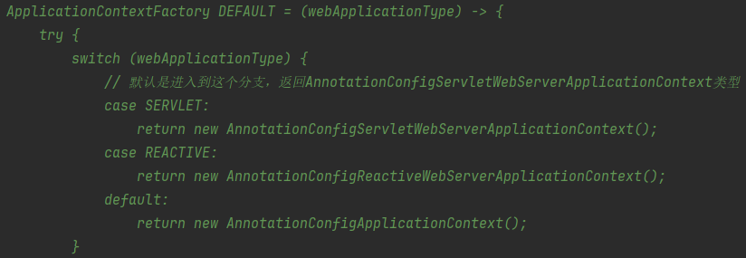
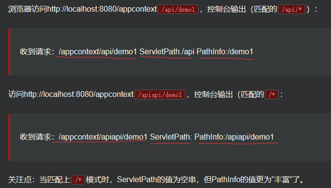
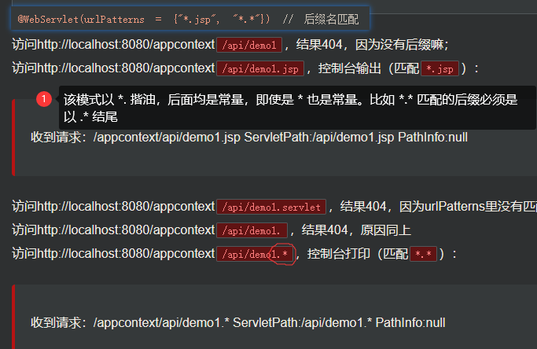
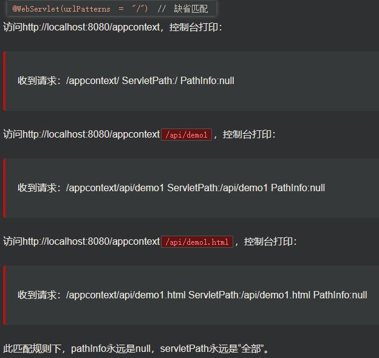
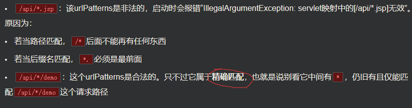

# SpringBoot底层机制

```xml
<!--导入springboot父工程-规定写法，指定依赖的版本(还需要实际引入)-->
<parent>
    <artifactId>spring-boot-starter-parent</artifactId>
    <groupId>org.springframework.boot</groupId>
    <version>2.5.3</version>
</parent>

<dependencies>
    <dependency>
        <groupId>org.springframework.boot</groupId>
        <artifactId>spring-boot-starter-web</artifactId>
        <!--自己创建Tomcat对象并启动，因此排除内嵌的spring-boot-starter-tomcat-->
        <exclusions>
            <exclusion>
                <groupId>org.springframework.boot</groupId>
                <artifactId>spring-boot-starter-tomcat</artifactId>
            </exclusion>
        </exclusions>
    </dependency>

    <!--指定tomcat版本，引入tomcat依赖/库
    1. 使用指定的tomcat版本8.5.75
    2. 如果我们引入了自己指定的tomcat，需要排除spring-boot-starter-tomcat
    3. 如果不排除，会出现 GenericServlet Not Found错误提示
    -->
    <dependency>
        <groupId>org.apache.tomcat.embed</groupId>
        <artifactId>tomcat-embed-core</artifactId>
        <version>8.5.75</version>
    </dependency>

    <dependency>
        <groupId>org.apache.tomcat</groupId>
        <artifactId>tomcat-jasper</artifactId>
        <version>8.5.75</version>
    </dependency>
</dependencies>
```

- [SpringApplication.run源码分析](src/main/java/com/charlie/springboot/MainApp.java)
- 底层机制：IO/文件扫描+注解+反射+集合+映射

| 类名                                 | 方法名                      | 执行                                                                                                    | 功能                                                  |
|------------------------------------|--------------------------|-------------------------------------------------------------------------------------------------------|-----------------------------------------------------|
| MainApp.java                       | main                     | `SpringApplication.run(MainApp.class, args);`                                                         | 程序启动                                                |
| SpringApplication.java             | run                      | `context = this.createApplicationContext();`                                                          | 创建容器                                                |
| SpringApplication.java             | createApplicationContext | `return this.applicationContextFactory.create(this.webApplicationType);`                              | 根据类型创建对象，默认是SERVLET                                 |
| ApplicationContextFactory.java     |   |                                                                                                       |                                                     |
| SpringApplication.java             | refreshContext(context)  | `进入ServletWebServerApplicationContext执行super.refresh();`                                              |                                                     |
| AbstractApplicationContext         | refresh                  | `this.onRefresh();在该类中执行完通用工作后，再动态绑定回到子类`                                                             | 注入相关Bean                                            |
| ServletWebServerApplicationContext | onRefresh                | `this.createWebServer();`                                                                             | 创建webServer，即创建指定web服务器——tomcat                     |
| ServletWebServerApplicationContext | createWebServer          | `this.webServer = factory.getWebServer(new ServletContextInitializer[]{this.getSelfInitializer()});`  | 使用TomcatServletWebServerFactory创建一个Tomcat的WebServer |
| TomcatServletWebServerFactory      | getWebServer             | `Tomcat tomcat = new Tomcat(); return this.getTomcatWebServer(tomcat);`                               | 创建Tomcat对象并设置相关属性；                                  |
| TomcatServletWebServerFactory      | getTomcatWebServer       | `调用 new TomcatWebServer(tomcat, this.getPort() >= 0, this.getShutdown());`                            | 创建TomcatWebServer，进行初始化                             |
| TomcatServletWebServerFactory      | initialize               | `this.tomcat.start();`                                                                                | 启动Tomcat                                            |

1. 创建容器
2. 刷新上下文(容器)：初始化默认设置、注入相关bean
3. 创建Tomcat并设置相关属性
4. 启动Tomcat

## Servlet路径

### Servlet四种匹配方式

1. 精确匹配：`urlPatterns`是一个无通配符的精确字符串。如`/api/demo1`等
2. 路径匹配：以`/`开头，且以`/*`结尾。如`/api/*`、`/*`等
   - 
3. 后缀名匹配：以`*.`开头。如`*.jsp`、`*.*`等，`/api/*.jsp`不符合
   - 
4. 缺省匹配：固定值`/`
   - 

### URL匹配注意事项

1. Servlet对URL的匹配既不是Ant风格，也不是Regex。特殊符号只有单个的`*`，且使用位置有强约束，切忌想当然的随意拼凑
2. 

### 匹配顺序

1. Servlet遵循：越精确越优先，越模糊越靠后
2. 按范围从小到大(优先级从高到低)排序为：精确匹配>路径匹配(包含`/*`)>后缀名匹配>缺省匹配(`/`)

### /和/*的区别

- 相同点：绝大部分场景下具有相同的表现：**匹配所有**
- 不同点：
  - 关于`/`：
    - servlet中特殊的匹配模式(用在Filter中无效)
    - 因为是缺省匹配代表匹配所有路径，所以只可能存在一个实例(若存在多个就覆盖)
    - **优先级最低**，这是和/*的最大区别。它**不会覆盖任何其它的url-pattern，只会覆盖Servlet容器内建的DefaultServlet**
  - 关于`/*`：
    - 属于4中匹配模式中的**路径匹配**，可用于Servlet和Filter
    - 优先级很高(仅次于精确匹配)。所以它**会覆盖所有的后缀名匹配**，从而很容易引起404问题，所以这种模式的“伤害性”是非常强的，**一般有且仅用在Filter上**

### DispatcherServlet不拦截.jsp请求原因分析

> `/`只能用于Servlet上，`/*`一般只用于Filter上

Spring MVC的`DispatcherServlet`的匹配路径默认就是`/`
- 它会拦截各种各样的请求，诸如：`/api/demo1`、`/html/demo1.html`、`/static/main.js`
- 不会拦截`/api/demo1.jsp`这种以`.jsp`结尾的请求。
- 因为Servlet容器(如Tomcat)内置有专门匹配.jsp这种请求的Servlet处理器，后缀名匹配优先级高于缺省匹配，
  所以.jsp结尾的请求不会被DispatcherServlet所“截胡”而是交给了JspServlet处理

## 实现SpringBoot底层机制

> Tomcat启动分析+Spring容器初始化+Tomcat如何关联容器

### 1.创建Tomcat并启动

```java
package com.charlie.myspringboot;

import org.apache.catalina.startup.Tomcat;

public class CharlieSpringApplication {
    // 这里会创建Tomcat对象，关联Spring容器，并启动
    public static void run() {
        try {
            // 创建Tomcat对象
            Tomcat tomcat = new Tomcat();
            // 设置监听端口
            tomcat.setPort(9090);
            // 启动Tomcat服务器
            tomcat.start();
            // 等待请求接入，Tomcat就会一致保持运行状态，接收客户端请求
            System.out.println("========9090等待请求========");
            tomcat.getServer().await();
        } catch (Exception e) {
            throw new RuntimeException(e);
        }
    }
}
```

### 2.创建Spring容器

```java
package com.charlie.myspringboot.config;

import com.charlie.myspringboot.bean.Monster;
import org.springframework.context.annotation.Bean;
import org.springframework.context.annotation.ComponentScan;
import org.springframework.context.annotation.Configuration;

/**
 * - 问题：容器如何知道要扫描那些包？
 * - 在配置类可以指定要扫描的包：@ComponentScan("com.charlie.myspringboot.controller")
 */
@Configuration
@ComponentScan("com.charlie.myspringboot.controller")
public class CharlieConfig {
    // 注入Bean-monster对象，到Spring容器
    @Bean
    public Monster monster() {
        return new Monster();
    }
}
```

```java
package com.charlie.myspringboot;
/**
 * Initializer：初始化器
 * 1. 创建Spring容器
 * 2. 加载/关联Spring容器的配置，按照注解的方式
 * 3. 完成Spring容器配置的bean的创建、依赖注入
 * 4. 创建前端控制器/分发控制器(DispatcherServlet)，并让其持有Spring容器
 * 5. 当DispatcherServlet持有容器，就可以进行分发映射(SpringMVC底层机制)
 * 6. onStartup 是Tomcat调用，并把ServletContext对象传入
 */
public class CharlieWebApplicationInitializer implements WebApplicationInitializer {
    @Override
    public void onStartup(ServletContext servletContext) throws ServletException {
        System.out.println("startup...");
        // 加载Spring web application configuration   =>      容器
        AnnotationConfigWebApplicationContext ac = new AnnotationConfigWebApplicationContext();
        // 在ac中注册 CharlieConfig.class 配置类，即将CharlieConfig类指定为配置类，当容器启动时，会读取并应用这些配置类中定义的配置信息
        ac.register(CharlieConfig.class);

        // 完成bean的创建和配置，会将CharlieConfig.class中配置的Bean实例化装入容器中
        ac.refresh();

        // 1. 创建注册非常重要的前端控制器DispatcherServlet
        // 2. 让 DispatcherServlet 持有容器
        // 3. 这样就可以进行映射转发
        DispatcherServlet dispatcherServlet = new DispatcherServlet(ac);
        // 返回了 ServletRegistration.Dynamic对象
        ServletRegistration.Dynamic registration =
                servletContext.addServlet("app", dispatcherServlet);
        // 当Tomcat启动时，加载dispatcherServlet
        registration.setLoadOnStartup(1);
        // 拦截请求，并进行分发处理
        registration.addMapping("/");   // 提示：/ 和 /* 的区别
    }
}
```

### 3.将Tomcat和Spring容器关联

```java
package com.charlie.myspringboot;

import org.apache.catalina.startup.Tomcat;

public class CharlieSpringApplication {
    // 这里会创建Tomcat对象，关联Spring容器，并启动
    public static void run() {
        try {
            // 创建Tomcat对象
            Tomcat tomcat = new Tomcat();
            
            // 1. 让tomcat可以将请求转发到Spring Web容器，因此需要关联
            // 2. "/myboot"：项目的application_context，就是配置tomcat时指定的application_context
            // 3. "E:\\springboot\\my_springboot"：指定项目的目录
            tomcat.addWebapp("/myboot", "E:\\springboot\\my_springboot");
            
            // 设置监听端口
            tomcat.setPort(9090);
            // 启动Tomcat服务器
            tomcat.start();
            // 等待请求接入，Tomcat就会一致保持运行状态，接收客户端请求
            System.out.println("========9090等待请求========");
            tomcat.getServer().await();
        } catch (Exception e) {
            throw new RuntimeException(e);
        }
    }
}
```

启动项目，运行`CharlieMainApp`

```java
package com.charlie.myspringboot;

public class CharlieMainApp {
    public static void main(String[] args) {
        // 启动CharlieSpringBoot项目
        CharlieSpringApplication.run();
    }
}
```
