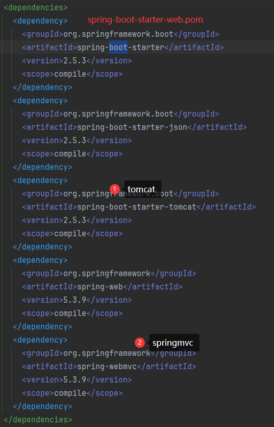
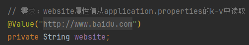
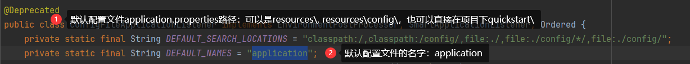
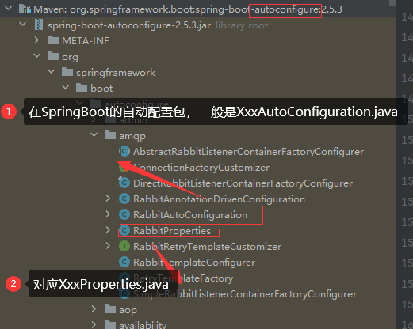

# SpringBoot

1. SpringBott可以轻松创建独立的、生产级的基于Spring的应用程序
2. SoringBoot直接嵌入Tomcat、Jetty或Undertow，可以**直接运行**Spring

## 快速入门

- 构建一个SpringBoot项目，浏览器发送/hello请求(http://localhost:8080/hello)，响应`Hello, SpringBoot`

1. 在 `pom.xml` 文件中引入SpringBoot父工程和web项目场景启动器
   - 
   - 
2. 创建SpringBoot应用主程序 `MainApp.java`
3. 创建控制器 `HelloController.java`

```java
package com.charlie.springboot;

import org.springframework.boot.SpringApplication;
import org.springframework.boot.autoconfigure.SpringBootApplication;

/**
 * @SpringBootApplication：标识这是一个SpringBoot应用
 */
@SpringBootApplication
public class MainApp {
    public static void main(String[] args) {
        // 启动SpringBoot应用程序/项目
        SpringApplication.run(MainApp.class, args);
    }
}
```

```java
package com.charlie.springboot.controller;

import org.springframework.stereotype.Controller;
import org.springframework.web.bind.annotation.RequestMapping;
import org.springframework.web.bind.annotation.ResponseBody;

@Controller
public class HelloController {

    @RequestMapping("/hello")
    @ResponseBody
    public String hello() {
        return "Hello, SpringBoot!";
    }
}
```

### 小结

1. SpringBoot比较传统的SSM开发，简化整合步骤，提高开发效率
2. 简化了Maven项目的`pom.xml`依赖导入, 可以说是一键导入
   - 
3. 引入一个 spring-boot-starter-web, 到底发生了什么?
   - 
4. 内置Tomcat, 简化服务器的配置

### Spring和SpringMVC和SpringBoot关系

1. SpringBoot>Spring>SpringMVC
2. SpringMVC只是Spring处理WEB层请求的一个模块/组件,SpringMVC的基石是`Servlet`
3. Spring的核心是IOC和AOP,**IOC提供了依赖注入的容器**，**AOP解决了面向切面编程**
4. SpringBoot是为了简化开发，推出的封神框架(**约定优于配置[COC]**，简化了Spring项目 的配置流程),SpringBoot包含很多组件/框架，
   Spring就是最核心的内容之一，也包含 SpringMVC
5. Spring家族，有众多衍生框架和组件例如boot、security、jpa等，他们的基础都是Spring

### 约定优于配置

1. 约定优于配置(Convention over Configuration/COC)，又称按约定编程，是一种软件设计规范，本质上是对系统、类库或框架中一些东西假定一个大众化合理的默认值(缺省值)
2. **期待的配置与约定的配置一致，那么就可以不做任何配置**，约定不符合期待时, 才需要对约定进行替换配置
3. 约定其实就是一种规范，遵循了规范，那么就存在通用性，存在通用性，那么事情就会变得相对简单，程序员之间的沟通成本会降低，工作效率会提升，合作也会变得更加简单
4. 例如在模型中存在一个名为User的类，那么对应到数据库会存在一个名为user的表，只有在偏离这个约定时才需要做相关的配置 (例如你想将表名命名为t_user等非user时才
   需要写关于这个名字的配置)

## 依赖管理和自动配置

### 依赖管理

1. spring-boot-starter-parent 还有父项目, 声明了开发中常用的依赖的版本号
2. 并且进行**自动版本仲裁**，即如果程序员没有指定某个依赖jar的版本，则以父项目指定的版本为准
   - 
   - 
3. 修改自动仲裁/默认版本号
   1) 查看spring-boot-dependencies.pom里面规定当前依赖的版本对应的key, 如mysql.version
      - 
   2) 

### starter场景启动器

- 
- 
- 
- 
- 

### 自动配置

- SpringBoot自动配置了Tomcat，SpringMVC等
  - 
- **自动配置遵循按需加载原则**，即引入了哪些场景starter就会加载该场景关联的jar包，没有引入的starter，则不会加载器关联的jar
  - 

```java
/**
 * @SpringBootApplication：标识这是一个SpringBoot应用
 *      - String[] scanBasePackages() default {};
 *      - scanBasePackages = {"com.charlie"} 指定SpringBoot要扫描的包及其子包，可以指定多个包
 */
@SpringBootApplication(scanBasePackages = {"com.charlie"})
public class MainApp {
    public static void main(String[] args) {
        // 启动SpringBoot应用程序/项目
        ConfigurableApplicationContext ioc = SpringApplication.run(MainApp.class, args);
        // 如何查看容器中注入的组件
        String[] beanDefinitionNames = ioc.getBeanDefinitionNames();
        for (String beanDefinitionName : beanDefinitionNames) {
            System.out.println("beanDefinitionName=" + beanDefinitionName);
        }
    }
}
```

- 自动配置：默认扫描包结构。默认扫描主程序 `MainApp.java` 所在包及其子包
  - 
- 修改默认配置：通过注解 `@SpringBootApplication(scanBasePackages = {"com.charlie"})`
  - 指定springboot扫描的包(同时会扫描其子包)，多条路径的话用逗号分隔即可

### resources\application.properties配置

- SpringBoot项目最终套也是最核心的配置文件就是 `application.properties`，所有框架配置都可以在该文件中说明
- [application.properties配置大全](https://blog.csdn.net/pbrlovejava/article/details/82659702)
- 各种配置都有默认配置(约定)，可以在 `resources\application.properties`中修改

```properties
# 修改server的监听窗口(端口号)
server.port=10001
# 应用的上下文路径(项目路径application_context)
server.servlet.context-path=/sb

# multipart 修改文件上传的大小
# multipart.max-file-size属性可以指定SpringBoot上传文件的大小限制
# 默认配置最终殴打hi是映射到某个类，比如multipart.max-file-size会映射/关联到MultipartProperties上，把光标定位在属性上
# 按 ctrl+b 就会定位到这个属性关联到的类(字段)
spring.servlet.multipart.max-file-size=5MB

# 自定义配置属性
my.website=http://www.baidu.com
```

- 对于properties文件中的自定义配置，可以通过 `@Value("${}")` 获取对应属性值
- 

### SpringBoot在哪配置读取application.properties

- 读取配置文件在 `ConfigFileApplicationListener.java`中
  - 
- SpringBoot所有的自动配置功能都在 `spring-boot-autoconfigure` 包里面
  - 
- `XxxProperties.java`和`XxxAutoConfiguration.java`都会加载到IOC容器中。
  - `XxxProperties.java`包含`Xxx`字段的默认值，通过 `application.properties` 可以进行自定义修改
  - `XxxAutoCOnfiguration.java`中定义了 `XxxProperties.java` 属性，读取了其中的配置
