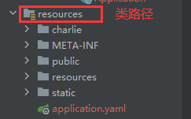

## WEB开发-静态资源访问

1. 只要静态资源放在**类路径**下：`/static`,`/public`,`/resources`,`/META-INF/resources`，就可以被直接访问。
   - 配置文件`WebProperties.java`
   - 
2. 常见静态资源：JS、CSS、图片(.jpg,.png,.bmp,.svg)、字体文件(Fonts)等
3. 访问方式：`项目根路径/+静态资源名`(默认)，比如`http://localhost:8080/hi.png`
   - 设置静态资源访问路径：`WebMvcProperties.java`
   - `this.staticPathPattern = "/**";`

### 注意事项和细节

1. **静态资源访问原理**：静态映射是`/**`，是对所有请求拦截。请求进来，先看Controller能不能处理，不能处理的请求交给**静态资源处理器**，
   如果静态资源找不到则响应404页面
2. 改变静态资源访问前缀：比如希望 `http://localhost:8080/charlieRes/...` 去请求静态资源。如在*静态资源访问前缀和控制器请求路径冲突*时
3. 改变默认的静态资源路径，如希望在类路径下新增`charlie`目录作为静态资源路径
   - 参看WebProperties.java下setStaticLocations方法
   - **配置`static-locations`会覆盖掉原有路径**
   - 因此如果要保留原来资源路径，则需要在配置的时候再加上去

```yaml
spring:
  mvc:
    # 修改静态资源访问的路径/前缀
    static-path-pattern: /charlieRes/**
    
  web:
    # 修改/增加静态资源路径
    resources:
      static-locations:   # private String[] staticLocations;
        # 修改/指定静态资源访问的路径/位置
        - "classpath:/charlie/"
        # 添加新路径/位置后，原来位置被破坏。如果需要，仍需要进行指定
        - "classpath:/META-INF/resources/"
        - "classpath:/resources/"
        - "classpath:/static/"
        - "classpath:/public/"
```
