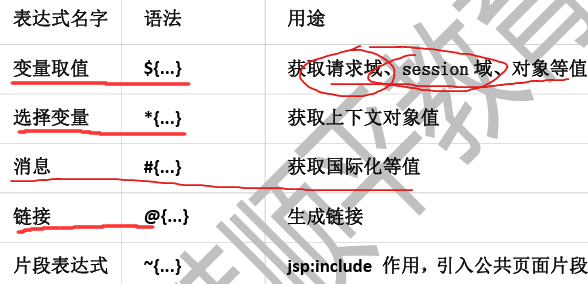
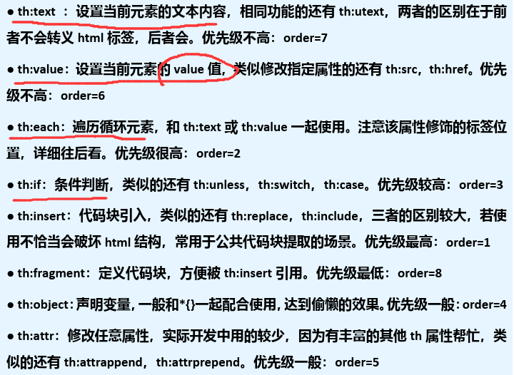
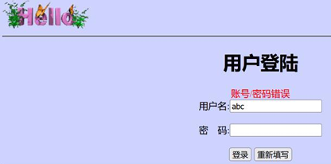
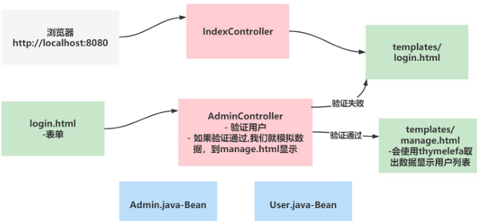
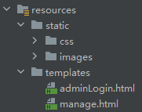
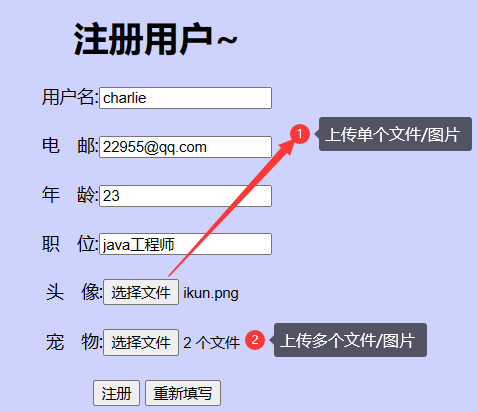
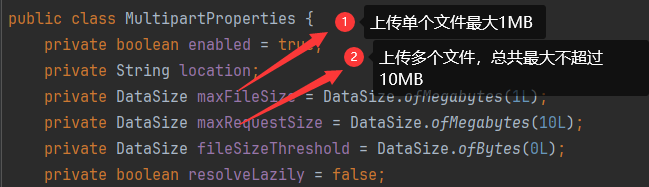

## Thymeleaf

- [Thymeleaf在线文档](https://www.thymeleaf.org/doc/tutorials/3.0/usingthymeleaf.html)
- Thymeleaf是一个跟Velocity、FreeMarker类似的模板引擎，可完全代替JSP
- Thymeleaf是一个java类库，他是一个`xml/xhtml/html5`的模板引擎，可以作为mvc的web应用的view层
- Thymeleaf的优点
  - 实现JSTL、OGNL表达式效果， 语法相似,java程序员上手快
  -  Thymeleaf 模版页面**无需服务器渲染，也可以被浏览器运行**，页面简洁
- Thymeleaf的缺点：并不是一个高性能的引擎，适用于单体应用

### Thymeleaf机制说明

1. Thymeleaf是**服务器渲染技术，页面数据是在服务端进行渲染的**
2. 比如:manage.html 中一段thymeleaf 代码, 是在用户请求该页面时，有thymeleaf模板引擎完成处理(在服务端完成), 并将结果页面返回
3. 因此使用了Thymeleaf，并不是前后端分离

### Thymeleaf语法

- 

th属性：html有的属性，Thymeleaf基本都有，而常用的属性大概有七八个。其中**th属性执行的优先级从1~8，数字越低优先级越高**
- 

### 使用Thymeleaf-th属性需要注意点

1. 若要使用Thymeleaf语法，首先要声明名称空间：`xmlns:th="http://www.thymeleaf.org`
2. 设置文本内容 th:text，设置input的值 th:value，循环输出 th:each，条件判断 th:if，插入代码块 th:insert，定义代码块 th:fragment，声明变量 th:object
3. th:each 的用法需要格外注意，如：如果你要循环一个div中的p标签，则th:each属性必须放在p标签上。若你将th:each属性放在div上，则循环的是将整个div。
4. 变量表达式中提供了很多的内置方法，该内置方法是用#开头，请不要与`#{}`消息表达式弄混

### Thymeleaf综合案例

- 需求说明：使用SpringBoot+Thymeleaf完成简单的用户登录-列表显示功能
  - 
  - 
- 思路分析
  - 
- 项目搭建
  - 需要引入thymeleaf场景启动器：`spring-boot-starter-thymeleaf`
  - 创建index.html和manage.html和静态图片到指定目录(`templates/`)，注意：**该目录不能直接访问**
  - 

```
// 默认前缀，即将包含Thymeleaf语法的.html文件放在类路径下的 templates/ 文件夹下
public static final String DEFAULT_PREFIX = "classpath:/templates/";
// 默认后缀
public static final String DEFAULT_SUFFIX = ".html";
```

### 代码实现

```java
@Controller
public class IndexController {

    // 编写方法，转发到登录页面
    @GetMapping(value = {"/", "/login"})
    public String login(HttpSession session) {
        // 重新登录，清空原有信息
        session.removeAttribute("loginAdmin");
        /*
        1. 因为引入了starter-thymeleaf场景启动器
        2. 这里就会直接使用视图解析到 thymeleaf 下的模板文件 adminLogin
         */
        return "adminLogin";
    }
}
```

```html
<!DOCTYPE html>
<html lang="en" xmlns:th="http://www.thymeleaf.org">
<head>
    <meta charset="UTF-8">
    <title>login</title>
</head>
<body bgcolor="#CED3FE">

<hr/>
<div style="text-align: center">
    <h1>用户登陆</h1>
    <!--意思是如果渲染成功，就用th:action内容替换action标签值；如果没有渲染成功，就是action默认值#
    #代表当前文档，即localhost:8080/，向当前文档提交可达到对应controller
    -->
    <form action="#" th:action="@{/login}" method="post">
        <label style="color: red" th:text="${msg}"></label><br/>
        用户名:<input type="text" style="width:150px" name="name"/><br/><br/>
        密　码:<input type="password" style="width:150px" name="password"/><br/><br/>
        <input type="submit" value="登录"/>
        <input type="reset" value="重新填写"/>
    </form>
</div>
<hr/>

</body>
</html>
```

```java
@Controller
public class AdminController {

    // 响应用户的登录请求
    @PostMapping(value = {"/login", "/"})
    public String login(Admin admin, HttpSession session, Model model) {
        // 放入model中的数据，最终会放到request域中
        // 1. 验证用户是否合法
        if (StringUtils.hasText(admin.getName()) && "666".equals(admin.getPassword())) {
            // 合法，就重定向到manage.html页面，不适用请求转发是放置刷新页面会重复提交
            // 将登录用户保存到session
            session.setAttribute("loginAdmin", admin);
            // 这里使用 /manage.html 是因为这样更加明确地表示到哪个页面
            // manage.html表示要求找方法的映射路径为 manage.html 的Controller
            return "redirect:/manage.html";
        } else {
            // 不合法就重新登录
            model.addAttribute("msg", "账号/用户错误！");
            return "adminLogin";
        }
    }

    // 处理用户请求 manage.html
    @GetMapping("/manage.html")
    public String mainPage(Model model, HttpSession session) {
        // 如果使用注解：@SessionAttribute("loginAdmin") Admin loginAdmin，则当session中没有该属性时会报错
        Object loginAdmin = session.getAttribute("loginAdmin");
        // 用户验证
        if (loginAdmin == null) {
            // 说明登录失败，这里就返回登录页面
            model.addAttribute("msg", "请登录");
            return "adminLogin";
        }
        // 使用集合模拟数据，放入到request域中
        ArrayList<User> users = new ArrayList<User>();
        users.add(new User(1, "关羽", "66666", 20, "gy@qq.com"));
        users.add(new User(2, "李自成", "66666", 42, "lzc@qq.com"));
        users.add(new User(3, "王世充", "66666", 36, "wsc@qq.com"));

        // 将数据放入到model，会自动放入到request域中
        model.addAttribute("users", users);
        return "manage";    // 这里才是视图解析器到 /templates/manage.html
    }
}
```

```html
<!DOCTYPE html>
<html lang="en" xmlns:th="http://www.thymeleaf.org">
<head>
  <meta charset="UTF-8">
  <title>管理后台</title>
</head>
<body bgcolor="#CED3FE">

<a href='#'>返回管理界面</a>　　<a href='#' th:href="@{/}">安全退出</a>    欢迎您：[[${session.loginAdmin.name}]]
<hr/>
<div style="text-align: center">
  <h1>管理雇员~</h1>
  <table border="1px" cellspacing="0" bordercolor="green" style="width:800px;margin: auto">
    <tr bgcolor="pink">
      <td>id</td>
      <td>name</td>
      <td>pwd</td>
      <td>email</td>
      <td>age</td>
    </tr>
    <tr bgcolor="#ffc0cb" th:each="user:${users}">
      <td th:text="${user.id}">a</td>
      <td th:text="${user.name}">b</td>
      <td th:text="${user.password}">c</td>
      <td th:text="${user.email}">d</td>
      <td th:text="${user.age}">e</td>
    </tr>
  </table>
  <br/>
</div>
<hr/>

</body>
</html>
```

## 拦截器-HandlerInterceptor

1. 在SpringBoot项目中，拦截器是开发中常用手段，用来做**登录验证、性能检测、日志记录**等
2. **基本步骤**
   1) 编写一个拦截器实现 `HandlerInterceptor` 接口
   2) 将拦截器注册到配置类中(实现`WebMvcConfigurer`接口的`addInteceptor`方法)
   3) 指定拦截规则

> 需求：使用拦截器防止用户非法登录，使用拦截器就不需要在每个方法验证了

```java
// 1. 编写一个拦截器实现 `HandlerInterceptor` 接口
@Slf4j
public class LoginInterceptor implements HandlerInterceptor {

    // 在目标方法执行前被调用
    @Override
    public boolean preHandle(HttpServletRequest request, HttpServletResponse response, Object handler) throws Exception {
        // 输出preHandle拦截到的请求的uri
        String requestURI = request.getRequestURI();
        String requestURL = request.getRequestURL().toString();
        log.info("preHandler拦截到的请求的URI={}", requestURI);     // /manage.html
        log.info("preHandler拦截到的请求的URL={}", requestURL);     // http://localhost:8080/manage.html
        // 进行登录校验
        HttpSession session = request.getSession();
        Object loginAdmin = session.getAttribute("loginAdmin");
        if (loginAdmin != null) {
            // 说明该用户已经成功登录，放行！
            return true;
        }
        // 拦截，重新返回到登录页面
        request.setAttribute("msg", "请登录~");
        // 请求转发到最初登录页面
        request.getRequestDispatcher("/").forward(request, response);
        return false;
    }

    // 目标方法执行后调用
    @Override
    public void postHandle(HttpServletRequest request, HttpServletResponse response, Object handler, ModelAndView modelAndView) throws Exception {
        log.info("postHandle执行了...");
    }

    @Override
    public void afterCompletion(HttpServletRequest request, HttpServletResponse response, Object handler, Exception ex) throws Exception {
        log.info("afterCompletion执行了...");
    }
}
```

```java
// 2. 将拦截器注册到配置类中(实现`WebMvcConfigurer`接口的`addInteceptor`方法)
@Configuration
public class WebConfig /*implements WebMvcConfigurer*/ {

  // 方式一
  //@Override
  //public void addInterceptors(InterceptorRegistry registry) {
  //    // 注册自定义拦截器loginInterceptor
  //    registry.addInterceptor(new LoginInterceptor())
  //            .addPathPatterns("/**")     // 拦截所有请求
  //            .excludePathPatterns("/", "/login", "/images/**");  // 指定放行路径，可以根据业务需要添加放行请求
  //}

  // 方式二
  @Bean
  public WebMvcConfigurer webMvcConfigurer() {
    return new WebMvcConfigurer() {
      @Override
      public void addInterceptors(InterceptorRegistry registry) {
        System.out.println("public WebMvcConfigurer webMvcConfigurer()...");
        registry.addInterceptor(new LoginInterceptor())
                .addPathPatterns("/**")
                .excludePathPatterns("/", "/login", "/images/**");
      }
    };
  }
}
```

### 注意事项和细节

1. URL和URI的区别
   - URI(UniversalResourceIdentifier,统一资源标识符)：可以唯一标识一个资源
   - URL(UniversalResourceLocator,统一资源定位符)：可以提供找到该资源的路径

## 文件上传

- 
- 

```html
<!DOCTYPE html>
<html lang="en" xmlns:th="http://www.thymeleaf.org">
<head>
    <meta charset="UTF-8">
    <title>upload</title>
</head>
<body bgcolor="#CED3FE">

<hr/>
<div style="text-align: center">
    <h1>注册用户~</h1>
    <form action="#" th:action="@{/upload}" method="post" enctype="multipart/form-data">
        用户名:<input type="text" style="width:150px" name="name"/><br/><br/>
        电　邮:<input type="text" style="width:150px" name="email"/><br/><br/>
        年　龄:<input type="text" style="width:150px" name="age"/><br/><br/>
        职　位:<input type="text" style="width:150px" name="job"/><br/><br/>
        头　像:<input type="file" style="width:150px" name="header"><br/><br/>
        <!-- multiple参数表示可以选择多个文件 -->
        宠　物:<input type="file" style="width:150px" name="photos" multiple><br/><br/>
        <input type="submit" value="注册"/>
        <input type="reset" value="重新填写"/>
    </form>
</div>
<hr/>

</body>
</html>
```

```java
@Controller
public class UploadController {

    // 处理转发到用户注册，可以完成用户上传页面
    @GetMapping("/upload.html")
    public String uploadPage() {
        return "upload";    // 使用视图解析，转发到 template/upload.html
    }

    // 处理用户的注册请求，包括处理文件上传
    @PostMapping("/upload")
    @ResponseBody
    public String upload(@RequestParam("name") String name, @RequestParam("email") String email,
                         @RequestParam("age") String age, @RequestParam("job") String job,
                         @RequestParam("header") MultipartFile header,
                         @RequestParam("photos") MultipartFile[] photos) throws IOException {

        // 输出获取到的信息
        log.info("上传的信息 name={} email={} age={} job={} header={} photos={}", name, email, age, job, header, photos);
        // 如果信息都成功得到，就将信息文件保存到指定目录
        // 1. 先将文件保存到指定目录
        // 2. 后面再吧温江保存到动态创建的目录

        // 1) 得到运行时的类路径
        String path = ResourceUtils.getURL("classpath:").getPath();
        // path=/E:/springboot/thymeleaf/target/classes/
        //log.info("path={}", path);
        File file = new File(path + WebUtils.getUploadFileDirectory());
        // 2) 动态创建指定目录
        if (!file.exists()) {   // 如果目录不存在，就创建
            file.mkdirs();
        }
        // 3) 将文件保存到指定目录/动态创建目录
        if (!header.isEmpty()) {    // 处理头像
            String originalFilename = header.getOriginalFilename();
            String fileName = UUID.randomUUID().toString() + "_" + System.currentTimeMillis() + "_" + originalFilename;
            // 这里需要指定保存文件的绝对路径
            //header.transferTo(new File("F:\\myshare\\" + originalFilename));
            // 保存文件的绝对路径=E:\springboot\thymeleaf\target\classes\static\images\ upload
            //log.info("保存文件的绝对路径={}", file.getAbsolutePath());
            header.transferTo(new File(file.getAbsolutePath() + "/" + fileName));
        }
        // 处理宠物图片
        if (photos.length > 0) {
            for (MultipartFile photo : photos) {    // 遍历
                if (!photo.isEmpty()) {
                    String originalFilename = photo.getOriginalFilename();
                    String fileName = UUID.randomUUID().toString() + "_" + System.currentTimeMillis() + "_" + originalFilename;
                    //photo.transferTo(new File("F:\\myshare\\" + originalFilename));
                    photo.transferTo(new File(file.getAbsolutePath() + "/" + fileName));
                }
            }
        }

        return "注册用户成功/文件上传成功！";
    }
}
```

```java
public class WebUtils {
    // 定义一个文件上传的路径
    public static String UPLOAD_FILE_DIRECTORY = "static/images/upload/";
    // 编写方法，生成一个目录，根据当前日期 年/月/日 创建目录
    public static String getUploadFileDirectory() {
        return UPLOAD_FILE_DIRECTORY + new SimpleDateFormat("yyyy-MM-dd").format(new Date());
    }
}
```

## 异常处理

1. 默认情况下，SpringBoot提供 `/error` 处理所有错误的映射
2. 对于机器客户端，它将生成JSOn响应，其中包含错误、HTTP状态和异常消息的详细信息。对于浏览器客户端，
   响应一个 `whitelabel` 错误视图，以HTML格式呈现相同的数据
   - 

#### 拦截器VS过滤器

1. 使用范围不同
   1) 过滤器实现的是 `javax.servlet.Filter` 接口，而这个接口是在Servlet规范中定义的，即过滤器Filter的使用依赖于Tomcat容器，Filter只能在Web程序中使用
   2) 拦截器(Interceptor)是一个Spring组件，由Spring容器管理，并不依赖Tomcat等容器，可以单独使用。不仅能应用在web程序中，也可以用于Application等程序中
2. 过滤器和拦截器的触发时机不同
   - 
   1) 过滤器Filter是在请求进入容器后,但在进入servlet之前进行预处理,请求结束是在servlet 处理完以后
   2)  拦截器Interceptor是在请求进入servlet后,在进入Controller之前进行预处理的,Controller中渲染了对应的视图之后请求结束
3. **过滤器不会处理请求转发，拦截器会处理请求转发**
4. 过滤器(Filter)对所有请求生效，包括静态资源、Servlet、JSP等，可以对请求和响应进行全局的处理
5. 拦截器(Interceptor)只对SpringMVC的请求生效，不能拦截静态资源

```java
// 用于模拟错误
@Controller
public class MyErrorController {

    // 模拟一个服务器内部错误500
    @GetMapping("/err")
    public String err() {
        int i = 10 / 0;
        return "manage";
    }

    // 这里配置是POST方式请求 /err2，一会使用get方式来请求 /err2
    // 这样就会出现一个4开头的错误 405:Method Not Allow
    @PostMapping("/err2")
    public String err2() {
        return "manage";
    }

    // 编写方法，模拟一个AccessException
    // 这里可以不加注解 @RequestParam ，加上则必须传入参数name
    @GetMapping("/err3")
    public String err3(/*@RequestParam(value = "name")*/ String name) {
        // 如果用户不是tom，就认为无权访问403
        if (!"tom".equals(name)) {
            throw new AccessException("自定义的异常信息");
        }
        return "manage";    // 请求转发到 manage.html，这里看不到数据因为没有经过填充
    }
}
```

### 自定义异常

- 底层是 `DefaultErrorViewResolver.class`
- 

```java
@Controller
public class MyErrorController {

    // 模拟一个服务器内部错误500
    @GetMapping("/err")
    public String err() {
        int i = 10 / 0;
        return "manage";
    }

    // 这里配置是POST方式请求 /err2，一会使用get方式来请求 /err2
    // 这样就会出现一个4开头的错误 405:Method Not Allow
    @PostMapping("/err2")
    public String err2() {
        return "manage";
    }

    // 编写方法，模拟一个AccessException
    // 这里可以不加注解 @RequestParam ，加上则必须传入参数name
    @GetMapping("/err3")
    public String err3(/*@RequestParam(value = "name")*/ String name) {
        // 如果用户不是tom，就认为无权访问403
        if (!"tom".equals(name)) {
            throw new AccessException("自定义的异常信息");
        }
        return "manage";    // 请求转发到 manage.html，这里看不到数据因为没有经过填充
    }
}
```

### 全局异常

1. `@ControllerAdvice`+`@ExceptionHandler`处理全局异常
2. 底层是 `ExceptionHandlerExceptionResolver` 支持的

> 全局异常处理优先级>默认异常处理机制

```java
@ControllerAdvice   // 使用它可以表示一个全局异常处理器/对象，会注入到spring容器
@Slf4j
public class GlobalExceptionHandler {
    // 编写方法，处理指定异常，如算术异常和空指针异常，可以指定多个异常
    // Exception e: 表示异常发生后，传递的异常对象
    // Model model: 可以将异常信息，放入到model，并传递给显示页面
    // HandlerMethod handlerMethod: 异常发生的方法
    @ExceptionHandler(value = {ArithmeticException.class, NullPointerException.class, AccessException.class})
    public String handleArithmeticException(Exception e, Model model, HandlerMethod handlerMethod) {
        // public java.lang.String com.charlie.springboot.controller.MyErrorController.err()
        // 在这里可以拿到异常发生的方法，是因为底层反射调用时传过来了HandlerMethods类型参数
        log.info("异常发生的方法={}", handlerMethod.getMethod());
        log.info("异常信息={}", e.getMessage());
        // 这里将发生的异常信息放入到model，可以在错误页面显示
        model.addAttribute("msg", e.getMessage());
        return "/error/global";     // 视图地址
    }
}
```

```java
// ExceptionHandlerExceptionResolver
@Nullable
protected ModelAndView doResolveHandlerMethodException(HttpServletRequest request, HttpServletResponse response, @Nullable HandlerMethod handlerMethod, Exception exception) {
    // 1. 先查看是否有对应的异常处理方法
    ServletInvocableHandlerMethod exceptionHandlerMethod = this.getExceptionHandlerMethod(handlerMethod, exception);
    if (exceptionHandlerMethod == null) {
        // 2. 如果没有则到默认异常处理中，DefaultErrorViewResolver.class
        return null;
    } else {
        if (this.argumentResolvers != null) {
            exceptionHandlerMethod.setHandlerMethodArgumentResolvers(this.argumentResolvers);
        }

        if (this.returnValueHandlers != null) {
            exceptionHandlerMethod.setHandlerMethodReturnValueHandlers(this.returnValueHandlers);
        }

        ServletWebRequest webRequest = new ServletWebRequest(request, response);
        ModelAndViewContainer mavContainer = new ModelAndViewContainer();
        ArrayList<Throwable> exceptions = new ArrayList();

        try {
            if (this.logger.isDebugEnabled()) {
                this.logger.debug("Using @ExceptionHandler " + exceptionHandlerMethod);
            }

            Throwable cause;
            for(Throwable exToExpose = exception; exToExpose != null; exToExpose = cause != exToExpose ? cause : null) {
                exceptions.add(exToExpose);
                cause = ((Throwable)exToExpose).getCause();
            }

            Object[] arguments = new Object[exceptions.size() + 1];
            exceptions.toArray(arguments);
            arguments[arguments.length - 1] = handlerMethod;
            // 3. 有对应的异常处理即全局异常处理，则将产生异常的方法等参数传入并调用该异常处理方法
            exceptionHandlerMethod.invokeAndHandle(webRequest, mavContainer, arguments);
        } catch (Throwable var13) {
            if (!exceptions.contains(var13) && this.logger.isWarnEnabled()) {
                this.logger.warn("Failure in @ExceptionHandler " + exceptionHandlerMethod, var13);
            }

            return null;
        }

        // 4. 填充模型并返回到对应异常页面
        if (mavContainer.isRequestHandled()) {
            return new ModelAndView();
        } else {
            ModelMap model = mavContainer.getModel();
            HttpStatus status = mavContainer.getStatus();
            ModelAndView mav = new ModelAndView(mavContainer.getViewName(), model, status);
            mav.setViewName(mavContainer.getViewName());
            if (!mavContainer.isViewReference()) {
                mav.setView((View)mavContainer.getView());
            }

            if (model instanceof RedirectAttributes) {
                Map<String, ?> flashAttributes = ((RedirectAttributes)model).getFlashAttributes();
                RequestContextUtils.getOutputFlashMap(request).putAll(flashAttributes);
            }

            return mav;
        }
    }
}
```

### 自定义异常

```java
/**
 * AccessException：自定义异常，java基础
 * @ResponseStatus(value = HttpStatus.FORBIDDEN)：表示发生AccessException异常，通过http协议返回的状态码403
 * 这个状态码和自定义异常的对应关系是由程序员自己定义的
 */
@ResponseStatus(value = HttpStatus.FORBIDDEN)
public class AccessException extends RuntimeException {

    // 显示定义无参构造器
    public AccessException() {}

    public AccessException(String message) {    // message：异常信息
        super(message);
    }
}
```

1. 如果SpringBoot 提供的异常不能满足开发需求，程序员也可以自定义异常
2. `@ResponseStatus`指定异常响应状态码+自定义异常
3. 当抛出自定义异常后，仍然会根据状态码，去匹配使用 x.html 显示

## 注入Servlet,Filter,Listener

1. 通过注解引入(`@WebServlet`)
   - [Servlet_](src/main/java/com/charlie/springboot/servlet/Servlet_.java)
2. 通过配置类引入(`@Configuration`)
   - [RegisterConfig_](src/main/java/com/charlie/springboot/config/RegisterConfig_.java)

## 内置Tomcat配置和切换

- 在SpringBoot中，`ServerProperties.java`配置类提供了对Http服务器的访问和修改能力

```yaml
server:  # 服务器配置
  # 配置端口
  port: 8080
  tomcat: # 对Tomcat进行配置
    threads:
      max: 10 # 最大的工作线程，默认是200
      min-spare: 5 # 最小工作线程，默认是10
    accept-count: 200 # tomcat启动的线程达到最大值，接受排队的请求个数，默认是100
    max-connections: 2000 # 最大连接数，并发数
    connection-timeout: 10000 # 建立连接的超时时间，单位是毫秒
```

- 也可以通过类来配置Tomcat

```java
package com.charlie.springboot.config;

import org.springframework.boot.web.server.WebServerFactoryCustomizer;
import org.springframework.boot.web.servlet.server.ConfigurableServletWebServerFactory;
import org.springframework.stereotype.Component;

/**
 * 通过类来配置Tomcat
 */
@Component
public class CustomizationBean implements WebServerFactoryCustomizer<ConfigurableServletWebServerFactory> {
    @Override
    public void customize(ConfigurableServletWebServerFactory factory) {
        factory.setPort(9090);  // 设置server的端口为9090
    }
}
```

- 切换WebServer，从Tomcat改为Undertow

> 因为不同的WebServer都实现了Servlet规范，即 `javax.Server.xxx`
> 当注销掉Tomcat时，该部分会报错，再次引入Undertow，则恢复正常

```xml
<dependencies>
    <dependency>
        <groupId>org.springframework.boot</groupId>
        <artifactId>spring-boot-starter-web</artifactId>
        <!--修改webServer：因为web场景启动器默认引入tomcat，要想切换，需要首先排除tomcat-->
        <!--<exclusions>-->
        <!--    <exclusion>-->
        <!--        <groupId>org.springframework.boot</groupId>-->
        <!--        <artifactId>spring-boot-starter-tomcat</artifactId>-->
        <!--    </exclusion>-->
        <!--</exclusions>-->
    </dependency>
    <!--引入undertow作为webServer-->
    <!--<dependency>-->
    <!--    <groupId>org.springframework.boot</groupId>-->
    <!--    <artifactId>spring-boot-starter-undertow</artifactId>-->
    <!--</dependency>-->
</dependencies>
```

## 数据库操作

- jdbc-HiKariDataSource

### 整合Druid到Spring-Boot

