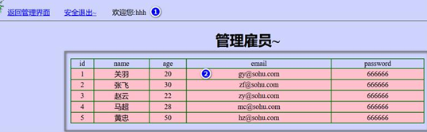

## Thymeleaf

- [Thymeleaf在线文档](https://www.thymeleaf.org/doc/tutorials/3.0/usingthymeleaf.html)
- Thymeleaf是一个跟Velocity、FreeMarker类似的模板引擎，可完全代替JSP
- Thymeleaf是一个java类库，他是一个`xml/xhtml/html5`的模板引擎，可以作为mvc的web应用的view层
- Thymeleaf的优点
  - 实现JSTL、OGNL表达式效果， 语法相似,java程序员上手快
  -  Thymeleaf 模版页面**无需服务器渲染，也可以被浏览器运行**，页面简洁
- Thymeleaf的缺点：并不是一个高性能的引擎，适用于单体应用

### Thymeleaf机制说明

1. Thymeleaf是**服务器渲染技术，页面数据是在服务端进行渲染的**
2. 比如:manage.html 中一段thymeleaf 代码, 是在用户请求该页面时，有thymeleaf模板引擎完成处理(在服务端完成), 并将结果页面返回
3. 因此使用了Thymeleaf，并不是前后端分离

### Thymeleaf语法

- 

th属性：html有的属性，Thymeleaf基本都有，而常用的属性大概有七八个。其中**th属性执行的优先级从1~8，数字越低优先级越高**
- 

### 使用Thymeleaf-th属性需要注意点

1. 若要使用Thymeleaf语法，首先要声明名称空间：`xmlns:th="http://www.thymeleaf.org`
2. 设置文本内容 th:text，设置input的值 th:value，循环输出 th:each，条件判断 th:if，插入代码块 th:insert，定义代码块 th:fragment，声明变量 th:object
3. th:each 的用法需要格外注意，如：如果你要循环一个div中的p标签，则th:each属性必须放在p标签上。若你将th:each属性放在div上，则循环的是将整个div。
4. 变量表达式中提供了很多的内置方法，该内置方法是用#开头，请不要与`#{}`消息表达式弄混

### Thymeleaf综合案例

- 需求说明：使用SpringBoot+Thymeleaf完成简单的用户登录-列表显示功能
  - 
  - 
- 思路分析
  - 
- 项目搭建
  - 需要引入thymeleaf场景启动器：`spring-boot-starter-thymeleaf`
  - 创建index.html和manage.html和静态图片到指定目录(`templates/`)，注意：**该目录不能直接访问**
  - 

```
// 默认前缀，即将包含Thymeleaf语法的.html文件放在类路径下的 templates/ 文件夹下
public static final String DEFAULT_PREFIX = "classpath:/templates/";
// 默认后缀
public static final String DEFAULT_SUFFIX = ".html";
```

### 代码实现

```java
@Controller
public class IndexController {

    // 编写方法，转发到登录页面
    @GetMapping(value = {"/", "/login"})
    public String login(HttpSession session) {
        // 重新登录，清空原有信息
        session.removeAttribute("loginAdmin");
        /*
        1. 因为引入了starter-thymeleaf场景启动器
        2. 这里就会直接使用视图解析到 thymeleaf 下的模板文件 adminLogin
         */
        return "adminLogin";
    }
}
```

```html
<!DOCTYPE html>
<html lang="en" xmlns:th="http://www.thymeleaf.org">
<head>
    <meta charset="UTF-8">
    <title>login</title>
</head>
<body bgcolor="#CED3FE">

<hr/>
<div style="text-align: center">
    <h1>用户登陆</h1>
    <!--意思是如果渲染成功，就用th:action内容替换action标签值；如果没有渲染成功，就是action默认值#
    #代表当前文档，即localhost:8080/，向当前文档提交可达到对应controller
    -->
    <form action="#" th:action="@{/login}" method="post">
        <label style="color: red" th:text="${msg}"></label><br/>
        用户名:<input type="text" style="width:150px" name="name"/><br/><br/>
        密　码:<input type="password" style="width:150px" name="password"/><br/><br/>
        <input type="submit" value="登录"/>
        <input type="reset" value="重新填写"/>
    </form>
</div>
<hr/>

</body>
</html>
```

```java
@Controller
public class AdminController {

    // 响应用户的登录请求
    @PostMapping(value = {"/login", "/"})
    public String login(Admin admin, HttpSession session, Model model) {
        // 放入model中的数据，最终会放到request域中
        // 1. 验证用户是否合法
        if (StringUtils.hasText(admin.getName()) && "666".equals(admin.getPassword())) {
            // 合法，就重定向到manage.html页面，不适用请求转发是放置刷新页面会重复提交
            // 将登录用户保存到session
            session.setAttribute("loginAdmin", admin);
            // 这里使用 /manage.html 是因为这样更加明确地表示到哪个页面
            // manage.html表示要求找方法的映射路径为 manage.html 的Controller
            return "redirect:/manage.html";
        } else {
            // 不合法就重新登录
            model.addAttribute("msg", "账号/用户错误！");
            return "adminLogin";
        }
    }

    // 处理用户请求 manage.html
    @GetMapping("/manage.html")
    public String mainPage(Model model, HttpSession session) {
        // 如果使用注解：@SessionAttribute("loginAdmin") Admin loginAdmin，则当session中没有该属性时会报错
        Object loginAdmin = session.getAttribute("loginAdmin");
        // 用户验证
        if (loginAdmin == null) {
            // 说明登录失败，这里就返回登录页面
            model.addAttribute("msg", "请登录");
            return "adminLogin";
        }
        // 使用集合模拟数据，放入到request域中
        ArrayList<User> users = new ArrayList<User>();
        users.add(new User(1, "关羽", "66666", 20, "gy@qq.com"));
        users.add(new User(2, "李自成", "66666", 42, "lzc@qq.com"));
        users.add(new User(3, "王世充", "66666", 36, "wsc@qq.com"));

        // 将数据放入到model，会自动放入到request域中
        model.addAttribute("users", users);
        return "manage";    // 这里才是视图解析器到 /templates/manage.html
    }
}
```

```html
<!DOCTYPE html>
<html lang="en" xmlns:th="http://www.thymeleaf.org">
<head>
  <meta charset="UTF-8">
  <title>管理后台</title>
</head>
<body bgcolor="#CED3FE">

<a href='#'>返回管理界面</a>　　<a href='#' th:href="@{/}">安全退出</a>    欢迎您：[[${session.loginAdmin.name}]]
<hr/>
<div style="text-align: center">
  <h1>管理雇员~</h1>
  <table border="1px" cellspacing="0" bordercolor="green" style="width:800px;margin: auto">
    <tr bgcolor="pink">
      <td>id</td>
      <td>name</td>
      <td>pwd</td>
      <td>email</td>
      <td>age</td>
    </tr>
    <tr bgcolor="#ffc0cb" th:each="user:${users}">
      <td th:text="${user.id}">a</td>
      <td th:text="${user.name}">b</td>
      <td th:text="${user.password}">c</td>
      <td th:text="${user.email}">d</td>
      <td th:text="${user.age}">e</td>
    </tr>
  </table>
  <br/>
</div>
<hr/>

</body>
</html>
```

## 拦截器-HandlerInterceptor

1. 在SpringBoot项目中，拦截器是开发中常用手段，用来做**登录验证、性能检测、日志记录**等
2. **基本步骤**
   1) 编写一个拦截器实现 `HandlerInterceptor` 接口
   2) 将拦截器注册到配置类中(实现`WebMvcConfigurer`接口的`addInteceptor`方法)
   3) 指定拦截规则

> 需求：使用拦截器防止用户非法登录，使用拦截器就不需要在每个方法验证了

```java
// 1. 编写一个拦截器实现 `HandlerInterceptor` 接口
@Slf4j
public class LoginInterceptor implements HandlerInterceptor {

    // 在目标方法执行前被调用
    @Override
    public boolean preHandle(HttpServletRequest request, HttpServletResponse response, Object handler) throws Exception {
        // 输出preHandle拦截到的请求的uri
        String requestURI = request.getRequestURI();
        String requestURL = request.getRequestURL().toString();
        log.info("preHandler拦截到的请求的URI={}", requestURI);     // /manage.html
        log.info("preHandler拦截到的请求的URL={}", requestURL);     // http://localhost:8080/manage.html
        // 进行登录校验
        HttpSession session = request.getSession();
        Object loginAdmin = session.getAttribute("loginAdmin");
        if (loginAdmin != null) {
            // 说明该用户已经成功登录，放行！
            return true;
        }
        // 拦截，重新返回到登录页面
        request.setAttribute("msg", "请登录~");
        // 请求转发到最初登录页面
        request.getRequestDispatcher("/").forward(request, response);
        return false;
    }

    // 目标方法执行后调用
    @Override
    public void postHandle(HttpServletRequest request, HttpServletResponse response, Object handler, ModelAndView modelAndView) throws Exception {
        log.info("postHandle执行了...");
    }

    @Override
    public void afterCompletion(HttpServletRequest request, HttpServletResponse response, Object handler, Exception ex) throws Exception {
        log.info("afterCompletion执行了...");
    }
}
```

```java
// 2. 将拦截器注册到配置类中(实现`WebMvcConfigurer`接口的`addInteceptor`方法)
@Configuration
public class WebConfig /*implements WebMvcConfigurer*/ {

  // 方式一
  //@Override
  //public void addInterceptors(InterceptorRegistry registry) {
  //    // 注册自定义拦截器loginInterceptor
  //    registry.addInterceptor(new LoginInterceptor())
  //            .addPathPatterns("/**")     // 拦截所有请求
  //            .excludePathPatterns("/", "/login", "/images/**");  // 指定放行路径，可以根据业务需要添加放行请求
  //}

  // 方式二
  @Bean
  public WebMvcConfigurer webMvcConfigurer() {
    return new WebMvcConfigurer() {
      @Override
      public void addInterceptors(InterceptorRegistry registry) {
        System.out.println("public WebMvcConfigurer webMvcConfigurer()...");
        registry.addInterceptor(new LoginInterceptor())
                .addPathPatterns("/**")
                .excludePathPatterns("/", "/login", "/images/**");
      }
    };
  }
}
```

### 注意事项和细节

1. URL和URI的区别
   - URI(UniversalResourceIdentifier,统一资源标识符)：可以唯一标识一个资源
   - URL(UniversalResourceLocator,统一资源定位符)：可以提供找到该资源的路径
